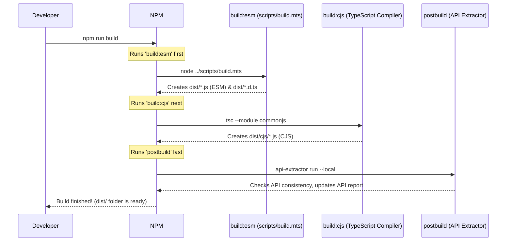

# Chapter 1: Library API & Packaging

Welcome to the `common-media-library`! If you're looking to understand how this library works, either to use it in your own projects or maybe even contribute, you're in the right place. This first chapter explains the "front door" of the library: what tools it offers and how it's delivered to you.

Imagine you've just received a new gadget, like a fancy coffee machine. It has buttons, a place to put water, and maybe a screen. You don't need to know exactly how the heating element or the grinder works internally to make coffee. You just need to know which buttons to press (the **API**) and that it arrived safely in a box, ready to plug in (the **Packaging**).

This chapter is about understanding the "buttons" and the "box" for the `@svta/common-media-library`.

**Use Case:** Let's say you're building a web application that plays videos. You want to collect some standard playback information called CMCD (Common Media Client Data) and send it to a server. The `common-media-library` has tools to help you format this data correctly. How do you access these tools from *your* code? And how can you be sure they'll work as expected?

## What is a Library API?

**API** stands for **A**pplication **P**rogramming **I**nterface. That sounds complicated, but it's just a fancy term for the collection of functions, classes, and types that a library *publicly exposes* for others to use.

Think of it like the control panel on our coffee machine:
*   **Public API:** The buttons (`makeEspresso()`, `addMilk()`), the screen showing status (`getCoffeeStatus()`), the water tank opening (`WaterTankInput`). These are designed for you, the user.
*   **Internal Implementation:** The hidden wires, pumps, heaters, and complex logic *inside* the machine that make the coffee. You don't interact with these directly.

In the `@svta/common-media-library`, the code is written in TypeScript (in the `src/` folder), but not everything inside `src/` is meant for direct use by library consumers. The library carefully chooses what to make "public". These public parts form the **API**.

**Why is this important?**
*   **Usability:** It provides clear entry points for using the library's features.
*   **Stability:** The library authors try hard not to make breaking changes to the *public* API. Internal details might change frequently, but the "buttons" should remain consistent.
*   **Simplicity:** You don't need to understand *everything* inside the library to use it effectively.

The main "door" to the library's API is usually defined in a file like `src/index.ts`, which exports the core functionalities.

## How is the Library Packaged? (The Box It Comes In)

When you want to use a library like this in your own JavaScript or TypeScript project, you typically install it using a package manager like npm (Node Package Manager):

```bash
npm install @svta/common-media-library
```

But how does your project know how to *understand* the code inside the installed package? JavaScript has evolved over time, and there are two main ways ("formats" or "module systems") that projects use to load code from libraries:

1.  **ES Modules (ESM):** The modern standard way, using `import` and `export` statements. This is common in web browsers and newer Node.js applications.
2.  **CommonJS (CJS):** The traditional way used by Node.js for many years, using `require()` and `module.exports`. Many existing projects and tools still rely on this.

To support both kinds of projects, `@svta/common-media-library` provides its code in *both* formats! How does it tell Node.js or your build tools which version to use? It uses the `exports` field in its `package.json` file.

Let's look at a simplified snippet from `lib/package.json`:

```json
// lib/package.json (simplified)
{
  "name": "@svta/common-media-library",
  "version": "0.11.0",
  "license": "Apache-2.0",
  "files": [ // Only these files/folders are included when published
    "dist/**/*",
    "NOTICE"
  ],
  "exports": {
    // When someone imports '@svta/common-media-library'
    ".": {
      // Provides TypeScript type definitions (for editor help, type checking)
      "types": "./dist/index.d.ts",
      // Use this file if the project uses ES Modules (import)
      "import": "./dist/index.js",
      // Use this file if the project uses CommonJS (require)
      "require": "./dist/cjs/index.js"
    },
    // Similar rules for importing specific files (less common)
    "./*": {
      "types": "./dist/*.d.ts",
      "import": "./dist/*.js",
      "require": "./dist/cjs/*.js"
    }
  },
  // Where to find the code when published
  "publishConfig": {
    "access": "public",
    "registry": "https://registry.npmjs.org"
  }
}
```

*   `"files"`: Lists the essential parts that get included in the package when it's published to npm. Notice the `dist` folder is key – this is where the compiled JavaScript lives.
*   `"exports"`: This acts like a map.
    *   The `.` key means "when someone imports the main package name".
    *   `"types"` points to the TypeScript declaration file (`.d.ts`). This file doesn't contain executable code, but it describes the *shape* of the JavaScript code (function names, parameters, return types) for tools like TypeScript and code editors (providing autocompletion!).
    *   `"import"` points to the ES Module version of the code (`dist/index.js`).
    *   `"require"` points to the CommonJS version of the code (`dist/cjs/index.js`).

Your project's environment (Node.js version, bundler settings) automatically uses this map to pick the correct file format, so you usually don't have to worry about it!

## The Build Process (How the Box is Made)

As mentioned, the library's source code is written in TypeScript (`.ts` files in the `src/` folder). Browsers and Node.js run JavaScript (`.js` files). So, there needs to be a step to translate the TypeScript code into JavaScript. This is called the **build process**.

You can run the build process using npm:

```bash
npm run build
```

What does this command do? It looks at the `scripts` section in `lib/package.json`:

```json
// lib/package.json (scripts section)
{
  "scripts": {
    // Runs both ESM and CJS builds, then runs API Extractor
    "build": "npm run build:esm && npm run build:cjs",
    "postbuild": "api-extractor run --local",

    // Builds the ES Module version using a custom script
    "build:esm": "node ../scripts/build.mts",

    // Builds the CommonJS version using the TypeScript compiler (tsc)
    "build:cjs": "tsc --module commonjs --verbatimModuleSyntax false --outDir dist/cjs",

    // Command to run tests
    "test": "node --test ./test/**/*.test.ts",

    // Automatically run build before publishing to npm
    "prepublishOnly": "npm run build"
  }
}
```

Let's break down the `build` script:
1.  `npm run build:esm`: Runs a custom script (`../scripts/build.mts`) that compiles the TypeScript source (`src/`) into ES Module JavaScript files, placing them in the `dist/` folder. It also generates the corresponding type declaration files (`.d.ts`).
2.  `npm run build:cjs`: Uses the TypeScript compiler (`tsc`) directly. The flags tell it:
    *   `--module commonjs`: Output CommonJS modules.
    *   `--outDir dist/cjs`: Put the output files in the `dist/cjs/` folder.
    *   It uses settings from `lib/tsconfig.json` (which extends `../tsconfig.json`) to know *which* files to compile and other compiler options.
3.  `postbuild`: After *both* builds succeed, this script runs `api-extractor run --local`. We'll discuss API Extractor next!

Here's a visual overview of the build process:



The `dist/` folder now contains the packaged JavaScript code (in both ESM and CJS formats) and the type definitions, ready to be used by other projects.

## Defining and Documenting the API (The Instruction Manual)

How do we ensure the "public face" (the API) of the library is clear, well-documented, and stable? The `common-media-library` uses two main tools for this:

1.  **TSDoc:** This is a standard for writing documentation comments directly inside TypeScript code. These comments start with `/**` and end with `*/`. They can include descriptions, information about parameters (`@param`), return values (`@returns`), and examples (`@example`).

    ```typescript
    // Example TSDoc comment (conceptual)
    /**
     * Parses a CMCD query string into a structured object.
     *
     * @param queryString - The raw CMCD query string (e.g., 'key1=value1&key2="string value"').
     * @returns An object representing the parsed CMCD data.
     * @public // Marks this function as part of the public API
     *
     * @example
     * ```ts
     * const data = parseCmcd('br=2500&ot=v');
     * console.log(data.br); // Output: 2500
     * ```
     */
    export function parseCmcd(queryString: string): Record<string, any> {
      // ... implementation details ...
      return {}; // Placeholder
    }
    ```
    The file `lib/tsdoc.json` contains configuration settings for how TSDoc comments should be interpreted, ensuring consistency.

2.  **API Extractor:** This is a powerful tool developed by Microsoft. After the TypeScript code is compiled (specifically, after the `.d.ts` type definition files are generated), API Extractor analyzes them.

    *   **It reads the public API:** It looks for exported functions, classes, types, etc., often guided by TSDoc tags like `@public`.
    *   **It reads TSDoc comments:** It understands the documentation written for the public API.
    *   **It generates an API Report:** It creates a file (usually `*.api.md`) that acts as a "snapshot" or summary of the *entire* public API. This file (`config/common-media-library.api.md` in this project) is meant to be checked into version control (like Git). If a code change results in a change to the public API (e.g., adding a function, changing a parameter), the `api.md` file will change. This makes API changes explicit and easy to review!
    *   **It enforces consistency:** It can report errors or warnings if, for example, something is exported publicly but lacks documentation, or if internal types are accidentally exposed.

    The configuration for API Extractor lives in `lib/config/api-extractor.json`. Let's look at some key parts:

    ```json
    // lib/config/api-extractor.json (simplified)
    {
      "$schema": "https://developer.microsoft.com/json-schemas/api-extractor/v7/api-extractor.schema.json",

      // Where to find the main entry point's type definition file
      "mainEntryPointFilePath": "<projectFolder>/dist/index.d.ts",

      // Configuration for the API Report file (*.api.md)
      "apiReport": {
        "enabled": true, // Yes, generate the report
        // Put the report in the 'config' folder within the library
        "reportFolder": "<projectFolder>/config/",
        // Name the report file based on the package name
        "reportFileName": "<unscopedPackageName>.api.md" // Results in common-media-library.api.md
      },

      // Configuration for generating a single ".d.ts" file (rollup)
      // This is disabled here, the library uses individual .d.ts files
      "dtsRollup": {
        "enabled": false
      },

      // Configuration for generating TSDoc metadata (useful for documentation tools)
      "tsdocMetadata": {
        "enabled": true,
        "tsdocMetadataFilePath": "<projectFolder>/dist/tsdoc-metadata.json"
      },

      // How to handle different types of messages (errors, warnings)
      "messages": {
        // ... rules for compiler, extractor, and TSDoc messages ...
      }
    }
    ```

    *   `mainEntryPointFilePath`: Tells API Extractor where to start analyzing the types – the main `index.d.ts` file generated by the build.
    *   `apiReport`: Configures the generation of the crucial `.api.md` file.
    *   `tsdocMetadata`: Creates a `tsdoc-metadata.json` file which can be useful for other documentation tools.

    Remember the `postbuild` script in `package.json`? It runs `api-extractor run --local` automatically after the code is compiled. This ensures the API report is always checked or updated as part of the build process.

## Putting It Together (Using the Library)

Now, let's revisit our use case: a developer wants to use a function from the library to parse CMCD data.

1.  **Installation:** They run `npm install @svta/common-media-library`.
2.  **Import:** In their project code, they can import the necessary function. Let's assume their project uses ES Modules:

    ```typescript
    // In your project's code (e.g., main.ts)
    import { parseCmcd } from '@svta/common-media-library';
    // If using CommonJS: const { parseCmcd } = require('@svta/common-media-library');

    // Now you can use the function!
    const myCmcdQueryString = 'br=3200&sf=s&sid="content-id-123"';

    try {
      const cmcdData = parseCmcd(myCmcdQueryString);

      console.log('Parsed CMCD data:', cmcdData);
      // Expected Output (example):
      // Parsed CMCD data: { br: 3200, sf: 's', sid: 'content-id-123' }

      // You can now use this structured data in your application
      // (We'll learn more about CMCD in the next chapter!)

    } catch (error) {
      console.error('Failed to parse CMCD string:', error);
    }
    ```

**What happened behind the scenes?**

*   When the code runs, the `import` statement triggers the Node.js module loader (or your bundler).
*   It looks at `@svta/common-media-library`'s `package.json` `exports` map.
*   Since this example assumes an ESM environment, it finds the `import` condition: `"import": "./dist/index.js"`.
*   It loads and executes `node_modules/@svta/common-media-library/dist/index.js`.
*   The `parseCmcd` function is now available to your code.
*   If you're using TypeScript or a smart code editor, it also reads `node_modules/@svta/common-media-library/dist/index.d.ts` (thanks to the `"types"` field in `exports`) to provide autocompletion and type checking for `parseCmcd`.
*   The TSDoc comments (processed by API Extractor) might even show up as documentation hints in your editor!

You get to use a well-defined, documented function without needing to know the intricate details of how `parseCmcd` works internally. The library's API and packaging handled the delivery and interface for you.

## Conclusion

In this chapter, we peeled back the first layer of the `@svta/common-media-library`. We learned:

*   The **Public API** is the set of tools (functions, classes, types) the library exposes for users. It's like the control panel of a device.
*   The library is **Packaged** into standard JavaScript formats (ESM and CommonJS) so different projects can use it. The `package.json` `exports` field directs tools to the right format.
*   A **Build Process** transforms the source TypeScript code (`src/`) into distributable JavaScript and type definitions (`dist/`).
*   **TSDoc** comments and **API Extractor** are used to document the public API and ensure its consistency, generating an `api.md` report file that tracks API changes.

Understanding these concepts gives you a foundation for how the library is structured, delivered, and maintained. Now that you know how to access the library's tools, we can start exploring what those tools actually do!

Ready to dive into one of the core features? Let's move on to handling specific kinds of media data.

**Next:** [Chapter 2: CMCD Data Handling](02_cmcd_data_handling_.md)

---

Generated by [AI Codebase Knowledge Builder](https://github.com/The-Pocket/Tutorial-Codebase-Knowledge)