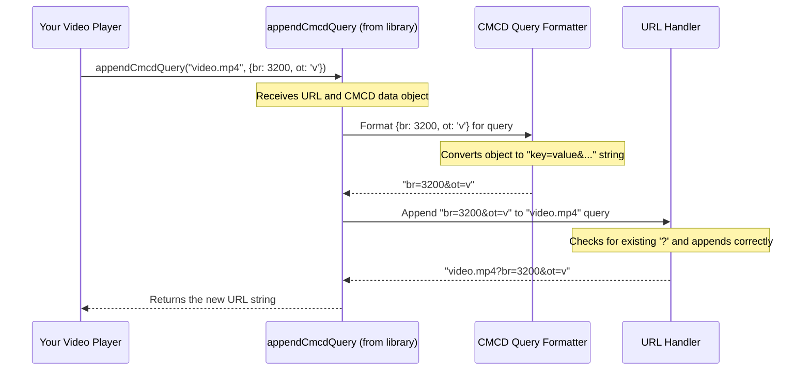

# Chapter 2: CMCD Data Handling

In [Chapter 1: Library API & Packaging](01_library_api___packaging_.md), we learned how the `common-media-library` is structured and delivered, giving us the tools (the API) in a ready-to-use package. Now, let's explore one of the key tools this library provides: handling CMCD data.

## What's the Big Idea? Making Streaming Smarter

Imagine you're watching a movie online. Sometimes it plays smoothly, but other times it buffers... and buffers... 😠. Wouldn't it be great if your video player could tell the server providing the video, "Hey, things are a bit slow here!" or "My buffer is getting empty!" so the server could adjust?

That's exactly what **CMCD (Common Media Client Data)** is for!

**Use Case:** You are building a web-based video player. You want your player to send information about its current status (like the available network speed or how much video is buffered) back to the Content Delivery Network (CDN) that's sending the video segments. This information needs to be formatted according to the CMCD standard (CTA-5004). How can `common-media-library` help you create this CMCD data easily?

Think of it like a smart home system:
*   **Your Video Player:** A smart thermostat in a room.
*   **The CDN/Server:** The central heating/cooling system for the whole house.
*   **CMCD Data:** The messages the thermostat sends back to the central system (e.g., "Current temperature is 20°C", "Heating target is 22°C", "Window is open!").

By sending this CMCD data, the player helps the server make smarter decisions, like switching to a lower quality video stream if the network is slow, potentially avoiding buffering and giving you a smoother experience.

## What Does CMCD Data Look Like?

CMCD isn't magic; it's just structured information. It's made up of **key-value pairs**. Each key is a short code (like `br` for measured bitrate or `ot` for object type) defined by the standard, and the value provides the specific information.

Here are a few common CMCD keys:
*   `br`: **B**it**r**ate - The measured throughput in kbps. (e.g., `br=2500`)
*   `bl`: **B**uffer **l**ength - How much media is currently buffered, in milliseconds. (e.g., `bl=12300`)
*   `ot`: **O**bject **t**ype - The type of media being requested (e.g., `v` for video, `a` for audio, `av` for audio+video). (e.g., `ot=v`)
*   `sf`: **S**treaming **f**ormat - The format of the media (e.g., `d` for DASH, `h` for HLS, `s` for Smooth Streaming). (e.g., `sf=h`)
*   `sid`: **S**ession **ID** - A unique ID for the current playback session (often a string). (e.g., `sid="session-xyz789"`)

*Note: String values are usually enclosed in quotes.*

## How is CMCD Data Sent?

This key-value information needs to travel from the player (client) to the server. There are two main ways CMCD data is sent with a media request (like asking for the next video chunk):

1.  **HTTP Query Parameters:** Added to the end of the URL.
    ```
    https://example.com/video/segment1.m4s?br=2500&bl=12300&ot=v
    ```
2.  **HTTP Headers:** Sent as special headers in the request.
    ```
    GET /video/segment1.m4s HTTP/1.1
    Host: example.com
    CMCD-Request: br=2500,bl=12300,ot=v
    CMCD-Object: mtp=15000
    ... (other headers)
    ```
    *(Notice headers might group keys differently, e.g., `CMCD-Request`, `CMCD-Object`, `CMCD-Session`, `CMCD-Status`)*

The `common-media-library` provides functions to help you format your player's data into these structures correctly.

## Using the Library to Handle CMCD

Let's get practical! How do you use the library to format CMCD data?

### Example 1: Adding CMCD to a URL (Query Parameters)

Imagine your player needs to request the next video segment from `https://cdn.example.com/video.mp4`. You've measured the bitrate (`br`) as 3200 kbps and know the object type (`ot`) is video (`v`).

You can use the `appendCmcdQuery` function:

```typescript
import { appendCmcdQuery } from '@svta/common-media-library/cmcd';
// Or using require:
// const { appendCmcdQuery } = require('@svta/common-media-library/cmcd');

const baseUrl = 'https://cdn.example.com/video.mp4';
const cmcdData = {
  br: 3200, // Bitrate in kbps
  ot: 'v'   // Object type is video
};

const newUrl = appendCmcdQuery(baseUrl, cmcdData);

console.log(newUrl);
```

**Expected Output:**

```
https://cdn.example.com/video.mp4?br=3200&ot=v
```

**Explanation:**

The `appendCmcdQuery` function took your base URL and the `cmcdData` object. It automatically formatted the data as query parameters (`br=3200&ot=v`) and correctly appended them to the URL. If the URL already had query parameters, it would add the CMCD ones correctly without breaking anything.

### Example 2: Creating CMCD HTTP Headers

Sometimes, you need to send CMCD data as HTTP headers instead. Let's say you have more data: bitrate (`br`), buffer length (`bl`), object type (`ot`), streaming format (`sf`), and a session ID (`sid`).

You can use the `createCmcdHeaders` function:

```typescript
import { createCmcdHeaders } from '@svta/common-media-library/cmcd';
// Or using require:
// const { createCmcdHeaders } = require('@svta/common-media-library/cmcd');

const cmcdData = {
  br: 2100,       // Bitrate
  bl: 8500,       // Buffer length (ms)
  ot: 'av',       // Object type (audio/video)
  sf: 'd',        // Streaming format (DASH)
  sid: "user-abc" // Session ID
};

const headers = createCmcdHeaders(cmcdData);

console.log(headers);
```

**Expected Output (example):**

```javascript
{
  'CMCD-Object': 'br=2100,ot="av"', // Keys related to the object being requested
  'CMCD-Request': 'bl=8500',      // Keys related to the request itself
  'CMCD-Session': 'sf="d",sid="user-abc"', // Keys related to the session
  'CMCD-Status': ''                // Keys related to playback status (none in this example)
}
```
*(Note: The library might return empty strings for header keys that have no corresponding CMCD data)*

**Explanation:**

The `createCmcdHeaders` function takes your `cmcdData` object and intelligently groups the keys into the standard CMCD header categories (`CMCD-Object`, `CMCD-Request`, `CMCD-Session`, `CMCD-Status`). It also correctly formats the values (like adding quotes around strings) according to the rules for HTTP headers. The specific format used for header values is defined by RFC8941, which we'll touch upon later in [Chapter 5: Structured Field Values (RFC8941) Serialization/Deserialization](05_structured_field_values__rfc8941__serialization_deserialization_.md).

## Under the Hood: How Does it Work?

When you call a function like `appendCmcdQuery` or `createCmcdHeaders`, what does the library do? Let's look at `appendCmcdQuery` as an example.

**High-Level Steps:**

1.  **Input:** Receives the base URL string and the CMCD data object (e.g., `{ br: 3200, ot: 'v' }`).
2.  **Validation (Optional but Good Practice):** Might check if the keys in the object are valid CMCD keys and if the values have the correct data type (number, string, etc.).
3.  **Serialization:** Converts the CMCD data object into the query string format. This involves:
    *   Iterating through the key-value pairs in the object.
    *   Creating strings like `key=value`.
    *   Joining these strings with `&`. Result: `"br=3200&ot=v"`
4.  **URL Handling:**
    *   Checks if the base URL already has a query string (contains a `?`).
    *   If yes, appends the new CMCD string using `&`.
    *   If no, appends the new CMCD string using `?`.
5.  **Output:** Returns the final, combined URL string.

**Sequence Diagram for `appendCmcdQuery`:**



**Simplified Code Insight:**

While the actual library code in `src/cmcd/appendCmcdQuery.ts` and related files (`src/cmcd/serializer/`) handles edge cases and validation robustly, the core idea of formatting the query string might look something like this conceptually:

```typescript
// Simplified concept - not actual library code!
function formatCmcdForQuery(data: Record<string, string | number | boolean>): string {
  const parts: string[] = [];
  for (const key in data) {
    // Basic check if the property belongs to the object
    if (Object.prototype.hasOwnProperty.call(data, key)) {
      const value = data[key];
      // NOTE: Real code needs proper validation and type handling!
      parts.push(`${key}=${value}`); // Simplified: no string quotes, boolean handling etc.
    }
  }
  return parts.join('&'); // Join with '&'
}

// Example usage within appendCmcdQuery (conceptual)
const cmcdQueryString = formatCmcdForQuery(cmcdData); // e.g., "br=3200&ot=v"
// ... then append cmcdQueryString to the baseUrl ...
```

The `createCmcdHeaders` function follows a similar process but uses a different serialization logic specific to HTTP headers (grouping keys and using comma separation, quoting strings), often relying on helpers related to [Chapter 5: Structured Field Values (RFC8941) Serialization/Deserialization](05_structured_field_values__rfc8941__serialization_deserialization_.md).

## Conclusion

CMCD is a powerful standard for making media streaming more efficient by allowing players to communicate their status to servers. The `common-media-library` simplifies working with CMCD by providing easy-to-use functions like `appendCmcdQuery` and `createCmcdHeaders`. These functions handle the complex formatting rules, letting you focus on gathering the necessary playback data in your application.

You now know how to generate CMCD data to send *from* the client *to* the server. But communication can go both ways! Sometimes, the server wants to send data back to the client.

**Next:** Let's explore the server's side of this communication in [Chapter 3: CMSD Data Handling](03_cmsd_data_handling_.md).

---

Generated by [AI Codebase Knowledge Builder](https://github.com/The-Pocket/Tutorial-Codebase-Knowledge)