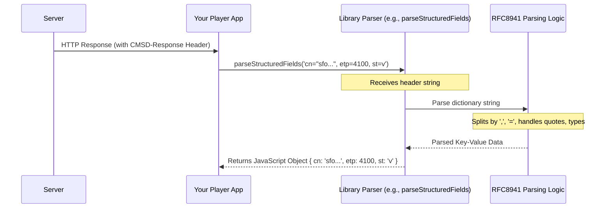

# Chapter 3: CMSD Data Handling

In [Chapter 2: CMCD Data Handling](02_cmcd_data_handling_.md), we learned how a media player (the client) can send status updates (CMCD) to the server to help improve streaming quality. But communication is often a two-way street! What if the server wants to send information *back* to the client or even to other servers involved in the delivery process?

That's where **CMSD (Common Media Server Data)** comes in. It's the counterpart to CMCD.

**Use Case:** Imagine your video player app requests a video segment. The server, besides sending the video, also wants to tell your player which specific server location (CDN edge node) handled the request and maybe suggest an alternative stream path if the current one is congested. How can the server format this information, and how can your player understand it?

Let's return to our smart home analogy:
*   **Your Video Player:** The smart thermostat.
*   **The CDN/Server:** The central heating/cooling system.
*   **CMCD:** Thermostat sending room temperature *to* the central system.
*   **CMSD:** The central system sending information *back* (e.g., "Energy usage is high today", "Try opening window X for better airflow", "I'm using the North zone heater").

CMSD allows the server to share useful metadata about the content or the delivery process.

## What is CMSD Data?

CMSD is a standard (CTA-5006) that defines a set of key-value pairs, much like CMCD, but typically sent *from* the server. This information can be used by the client to make better decisions, or by other servers in the delivery chain for logging and analysis.

Here are a few example CMSD keys:
*   `cn`: **C**DN **n**ode - The identifier of the CDN edge node handling the request. (e.g., `cn="ord-12.cdn.example.net"`)
*   `rs`: **R**elative **s**uggested path - Suggests an alternative relative path for the next request. (e.g., `rs="../alt-quality/segment5.m4s"`)
*   `st`: **S**tream **t**ype - The type of stream being served (e.g., `v` for VOD, `l` for live). (e.g., `st=l`)
*   `etp`: **E**ncoded **t**hrough**p**ut - The throughput (kbps) of the encoded media object. (e.g., `etp=4100`)

Just like CMCD, the keys are short codes, and the values provide specific details. String values are usually enclosed in quotes.

## How is CMSD Data Sent?

While CMCD is often sent in requests (query params or headers), CMSD is typically sent in **HTTP Response Headers**. The standard defines a header specifically for this:

*   `CMSD-Response`: Carries CMSD key-value pairs from the server back to the client.

Example HTTP Response:

```http
HTTP/1.1 200 OK
Content-Type: video/mp4
Content-Length: 1234567
CMSD-Response: cn="sfo-01.cdn.example", etp=4100, st=v
... (other headers)

[Video Data...]
```

In this response, the server is telling the client it's being served by `sfo-01.cdn.example`, the encoded throughput is 4100 kbps, and it's a VOD stream.

## Using the Library to Handle CMSD

The `common-media-library` can help you work with this CMSD data. Primarily, if you are building a client (like a player), you'll use it to *parse* the CMSD headers you receive. If you are building a server, you might use it to *create* these headers.

### Example 1: Parsing a Received CMSD Header (Client-Side)

Your player makes a request and gets the HTTP response shown above. You extract the value of the `CMSD-Response` header. How do you turn that string into a useful JavaScript object?

Let's assume the library provides a function (perhaps similar to the CMCD header parser or a dedicated one) to parse Structured Field Values, which is the format used by CMSD headers. We'll call it `parseStructuredFields` for this example.

```typescript
// Hypothetical function name - check library docs for the actual one!
import { parseStructuredFields } from '@svta/common-media-library/sfv'; // Assuming it's related to SFV

// The value received from the CMSD-Response header
const cmsdHeaderValue = 'cn="sfo-01.cdn.example", etp=4100, st=v';

try {
  // Parse the header string into an object
  const cmsdData = parseStructuredFields(cmsdHeaderValue);

  console.log('Parsed CMSD data:', cmsdData);

  // Now your player can use this data
  if (cmsdData.cn) {
    console.log(`Served by CDN node: ${cmsdData.cn}`);
  }
  if (cmsdData.etp) {
    console.log(`Encoded throughput: ${cmsdData.etp} kbps`);
  }

} catch (error) {
  console.error('Failed to parse CMSD header:', error);
}
```

**Expected Output:**

```
Parsed CMSD data: { cn: 'sfo-01.cdn.example', etp: 4100, st: 'v' }
Served by CDN node: sfo-01.cdn.example
Encoded throughput: 4100 kbps
```

**Explanation:**

The hypothetical `parseStructuredFields` function took the raw header string. It understood the comma separation, the key=value structure, and how to handle quotes around strings and recognize numbers. It returned a simple JavaScript object `cmsdData`, making the information easy to access and use in your player's logic.

*Important Note:* The actual parsing of CMSD headers relies heavily on the rules defined in RFC8941 for Structured Field Values. We'll explore this more in [Chapter 5: Structured Field Values (RFC8941) Serialization/Deserialization](05_structured_field_values__rfc8941__serialization_deserialization_.md).

### Example 2: Creating a CMSD Header String (Server-Side)

Now, let's imagine you are building a server application using Node.js and want to *send* a `CMSD-Response` header. You can use the library to format your data object into the correct string representation.

Let's assume the library provides a function like `createStructuredFieldsString`.

```typescript
// Hypothetical function name - check library docs!
import { createStructuredFieldsString } from '@svta/common-media-library/sfv';

const serverData = {
  cn: 'iad-99.cdn.example', // CDN node
  st: 'l',                 // Stream type: Live
  etp: 3550                // Encoded throughput
};

try {
  // Create the header string from the data object
  const cmsdHeaderString = createStructuredFieldsString(serverData);

  console.log('CMSD-Response header value:', cmsdHeaderString);

  // You would then add this string as the value for the
  // 'CMSD-Response' header in your HTTP response.

} catch (error) {
  console.error('Failed to create CMSD header string:', error);
}
```

**Expected Output:**

```
CMSD-Response header value: cn="iad-99.cdn.example", st="l", etp=3550
```

**Explanation:**

The hypothetical `createStructuredFieldsString` function took the JavaScript object `serverData`. It iterated through the keys and values, formatting them according to the Structured Field Values rules (adding quotes to strings, keeping numbers as numbers) and joined them with commas. The resulting string is ready to be used as the value for the `CMSD-Response` HTTP header.

## Under the Hood: How Does Parsing Work?

When you receive a CMSD header like `cn="sfo-01.cdn.example", etp=4100, st=v` and pass it to a parsing function, what happens?

**High-Level Steps:**

1.  **Input:** Receives the header string value.
2.  **Underlying Format:** Recognizes this as a "Dictionary" structure according to **RFC8941 (Structured Field Values)**. This standard defines exactly how to represent different data types (strings, numbers, booleans, etc.) and lists/dictionaries in HTTP headers. We cover this in detail in [Chapter 5: Structured Field Values (RFC8941) Serialization/Deserialization](05_structured_field_values__rfc8941__serialization_deserialization_.md).
3.  **Parsing Logic (Simplified):**
    *   Splits the string by commas (`,`) to get individual key-value pairs (`cn="sfo-01.cdn.example"`, ` etp=4100`, ` st=v`).
    *   For each pair, splits by the first equals sign (`=`) to separate the key and the value.
    *   Trims whitespace from keys and values.
    *   Parses the value according to RFC8941 rules:
        *   If it starts and ends with quotes (`"`), it's a string (remove quotes).
        *   If it looks like a number, parse it as a number.
        *   If it's `?1` or `?0`, it's a boolean (true/false).
        *   (Handles more complex types like tokens, byte sequences, inner lists, etc.)
4.  **Output:** Constructs and returns a JavaScript object mapping the parsed keys to their parsed values.

**Sequence Diagram for Parsing:**



**Simplified Code Insight (Conceptual):**

The actual implementation involves careful adherence to RFC8941, often found in files related to `sfv` or `structuredfieldvalues` within the library. A highly simplified view of parsing might look like this:

```typescript
// Simplified concept - not actual library code!
// Assumes input is like 'key1=value1, key2="string", key3=?1'
function conceptualParseSfvDictionary(headerValue: string): Record<string, any> {
  const result: Record<string, any> = {};
  const pairs = headerValue.split(','); // Step 1: Split by comma

  for (const pair of pairs) {
    const trimmedPair = pair.trim();
    const equalsIndex = trimmedPair.indexOf('=');
    if (equalsIndex === -1) continue; // Skip if no '='

    const key = trimmedPair.substring(0, equalsIndex).trim(); // Step 2: Get key
    let valueStr = trimmedPair.substring(equalsIndex + 1).trim(); // Step 2: Get value string

    // Step 3: Rudimentary value parsing (Real SFV is more complex!)
    let value: any;
    if (valueStr.startsWith('"') && valueStr.endsWith('"')) {
      value = valueStr.substring(1, valueStr.length - 1); // String
    } else if (valueStr === '?1') {
      value = true; // Boolean true
    } else if (valueStr === '?0') {
      value = false; // Boolean false
    } else if (!isNaN(Number(valueStr))) {
      value = Number(valueStr); // Number
    } else {
      value = valueStr; // Assume Token or unrecognized
    }
    result[key] = value;
  }
  return result; // Step 4: Return object
}
```

This conceptual code illustrates splitting and basic type detection. The real library functions handle many more edge cases and the full complexity specified by RFC8941.

## Conclusion

CMSD completes the communication loop started by CMCD, allowing servers to send structured metadata back to clients or other intermediaries. This data, typically sent in the `CMSD-Response` HTTP header, provides valuable insights about the content delivery process.

In this chapter, we learned:
*   What CMSD is and why it's useful (server-to-client/other metadata).
*   How it's commonly transmitted (via the `CMSD-Response` header).
*   How the `common-media-library` likely provides tools to **parse** received CMSD header strings into easy-to-use JavaScript objects (using underlying Structured Field Value logic).
*   How the library could also be used to **create** correctly formatted CMSD header strings (useful for server implementations).

Understanding CMSD, alongside CMCD, gives you a fuller picture of how modern media streaming uses standardized metadata for optimization and monitoring.

So far, we've looked at metadata transmitted alongside HTTP requests/responses. But sometimes, metadata is embedded directly *within* the media files themselves.

**Next:** Let's explore how the library helps look inside media files in [Chapter 4: ISOBMFF (MP4) Box Parsing](04_isobmff__mp4__box_parsing_.md).

---

Generated by [AI Codebase Knowledge Builder](https://github.com/The-Pocket/Tutorial-Codebase-Knowledge)