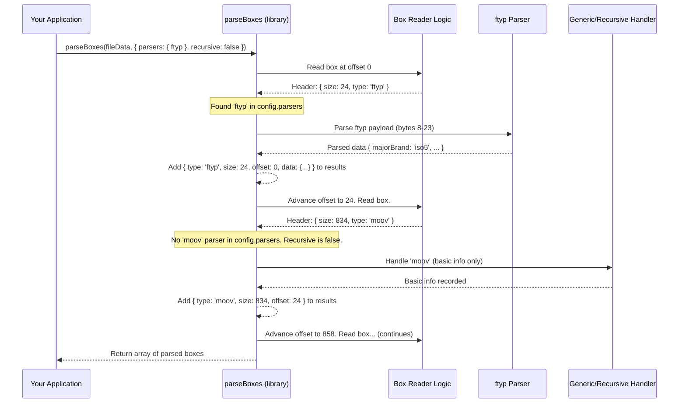

# Chapter 4: ISOBMFF (MP4) Box Parsing

In the previous chapters ([Chapter 2: CMCD Data Handling](02_cmcd_data_handling_.md) and [Chapter 3: CMSD Data Handling](03_cmsd_data_handling_.md)), we explored metadata that travels alongside media requests via HTTP headers or query parameters. Now, let's shift our focus and look *inside* the media files themselves.

## What's the Big Idea? Seeing Inside the Container

Imagine you have a large shipping container (an MP4 video file). You know it contains goods (video and audio data), but you need specific information without unpacking the *entire* container. Maybe you just need to check the shipping manifest near the door to see what *kind* of goods are inside, or find an index listing the main sections.

This is where **ISOBMFF Box Parsing** comes in.

**Use Case:** You're building a tool for video processing. Before doing any heavy work, you need to quickly inspect an MP4 file:
1.  Is it a standard MP4 or a fragmented MP4 (fMP4) suitable for streaming?
2.  What's the total duration of the video?
3.  Where is the segment index located, if it exists?

Doing this efficiently means reading only small, specific parts of the file, not the whole thing, especially if the file is huge. The `common-media-library` provides tools to do exactly this "X-ray inspection".

## Key Concepts: ISOBMFF and Boxes

1.  **ISOBMFF (ISO Base Media File Format):** This is a standard specification (like a blueprint) that defines a general structure for time-based media files. Think of it as the international standard for how shipping containers should be built and organized internally. MP4 is the most common file type based on this standard, but others exist (like `.mov`, `.3gp`).

2.  **Boxes (or Atoms):** The fundamental building blocks of an ISOBMFF file. Each box is like a labeled compartment within the shipping container.
    *   It starts with a **size** (how big the compartment is) and a **type** (a 4-character code, like a label, e.g., `ftyp`, `moov`, `mdat`, `sidx`).
    *   It contains **data**. This data might be simple information, media samples (audio/video), or even *other boxes*.

    This ability for boxes to contain other boxes creates a hierarchy, like nested folders on your computer.

    *   `ftyp` (File Type Box): Usually the very first box. Tells you the "brand" of the file (e.g., `mp42`, `iso5`, `dash`) and compatibility. It's like the main label on the shipping container.
    *   `moov` (Movie Box): Contains metadata about the entire presentation (duration, timescales, track information). It's like the main manifest or table of contents folder.
    *   `mvhd` (Movie Header Box): Typically found inside `moov`. Contains global information like duration and creation time.
    *   `mdat` (Media Data Box): Usually the largest box, containing the actual video frames and audio samples. It's the main cargo hold.
    *   `sidx` (Segment Index Box): Provides a byte-range index to different segments within the file, crucial for streaming. It's like an index pointing to specific sections of the cargo.
    *   `styp` (Segment Type Box): Similar to `ftyp`, but used in fragmented MP4 files to indicate the type of a specific segment.

The `common-media-library` helps you navigate this structure and extract information from these boxes.

## Using the Library for Box Parsing

Let's see how to use the library functions to solve our use case. Assume you've fetched the first few kilobytes (e.g., 16KB) of an MP4 file into an `ArrayBuffer` called `fileData`.

### Example 1: Parsing Top-Level Boxes

You want to see the main "compartments" at the start of the file.

```typescript
import { parseBoxes, ftyp, mvhd, sidx } from '@svta/common-media-library/isobmff';

// Assume 'fileData' is an ArrayBuffer containing the start of an MP4 file
// const fileData = await fetch(url, { headers: { Range: 'bytes=0-16383' } }).then(res => res.arrayBuffer());

// Define which box types we want detailed parsing for
const config = {
  parsers: { ftyp, mvhd, sidx }, // Use built-in parsers for these types
  recursive: false // Only parse top-level boxes for now
};

try {
  const topLevelBoxes = parseBoxes(fileData, config);

  console.log('Found top-level boxes:');
  topLevelBoxes.forEach(box => {
    console.log(`- Type: ${box.type}, Size: ${box.size}, Offset: ${box.offset}`);
    // If a parser was provided (like for ftyp), 'box.data' will have parsed info
    if (box.data) {
      console.log('  Parsed data:', box.data);
    }
  });

} catch (error) {
  console.error('Error parsing boxes:', error);
}
```

**Expected Output (Example):**

```
Found top-level boxes:
- Type: ftyp, Size: 24, Offset: 0
  Parsed data: { majorBrand: 'iso5', minorVersion: 1, compatibleBrands: [ 'iso5', 'iso6', 'mp41', 'dash' ] }
- Type: moov, Size: 834, Offset: 24
- Type: sidx, Size: 52, Offset: 858
  Parsed data: { version: 0, flags: 0, referenceId: 1, timescale: 1000, earliestPts: 0, firstOffset: 858, references: [ /* ... */ ] }
- Type: mdat, Size: 15000, Offset: 910
  // ... more boxes if they fit in the buffer ...
```

**Explanation:**

*   We imported `parseBoxes` and specific parsers (`ftyp`, `mvhd`, `sidx`) from the library.
*   `parseBoxes` reads through the `fileData` `ArrayBuffer`.
*   For each box it finds, it records the `type`, `size`, and starting `offset`.
*   If the `type` matches one provided in `config.parsers` (like `ftyp` or `sidx`), it uses that specific parser function to decode the box's internal data and puts the result in the `data` property.
*   For boxes without a specific parser (like `moov` and `mdat` in this example), it just provides the basic header info.
*   Because `recursive: false`, it only looked at the top-level boxes, not boxes inside `moov`.

### Example 2: Finding a Specific Box (`sidx`)

You specifically need the *first* Segment Index box (`sidx`) to understand the file segmentation.

```typescript
import { findBoxByType, sidx } from '@svta/common-media-library/isobmff';

// Assume 'fileData' is an ArrayBuffer containing the start of an MP4 file

const config = {
  parsers: { sidx } // We want the sidx data parsed
};

try {
  // Search for the first 'sidx' box
  const sidxBox = findBoxByType('sidx', fileData, config);

  if (sidxBox) {
    console.log('Found sidx box:');
    console.log(`- Offset: ${sidxBox.offset}, Size: ${sidxBox.size}`);
    console.log('- Parsed data:', sidxBox.data);
  } else {
    console.log('No sidx box found in the provided data.');
  }

} catch (error) {
  console.error('Error finding box:', error);
}
```

**Expected Output (If `sidx` exists):**

```
Found sidx box:
- Offset: 858, Size: 52
- Parsed data: { version: 0, flags: 0, referenceId: 1, timescale: 1000, earliestPts: 0, firstOffset: 858, references: [ /* ... */ ] }
```

**Explanation:**

*   `findBoxByType` efficiently scans the `fileData` looking *only* for the box with type `'sidx'`.
*   It stops as soon as it finds the first one.
*   If found, it returns the parsed box object (including the `data` because we provided the `sidx` parser in the config). Otherwise, it returns `undefined`. This is much faster than `parseBoxes` if you only need one specific box.

### Example 3: Finding All Boxes of a Type (e.g., `trun`)

In fragmented MP4, each fragment might contain `trun` (Track Run) boxes detailing sample information. You might want to find all of them within a downloaded fragment.

```typescript
import { filterBoxesByType, trun } from '@svta/common-media-library/isobmff'; // Assuming 'trun' parser exists

// Assume 'fragmentData' is an ArrayBuffer containing one MP4 fragment

const config = {
  parsers: { trun }, // Use a parser for 'trun' if available
  recursive: true   // Search inside container boxes too (like 'traf')
};

try {
  // Find all 'trun' boxes within the fragment, searching recursively
  const trunBoxes = filterBoxesByType('trun', fragmentData, config);

  console.log(`Found ${trunBoxes.length} trun box(es):`);
  trunBoxes.forEach((box, index) => {
    console.log(`  [${index}] Offset: ${box.offset}, Size: ${box.size}`);
    if (box.data) {
      console.log('      Parsed data:', box.data);
    }
  });

} catch (error) {
  console.error('Error filtering boxes:', error);
}
```

**Expected Output (Example):**

```
Found 2 trun box(es):
  [0] Offset: 120, Size: 40
      Parsed data: { version: 0, flags: 257, sampleCount: 15, /* ... */ }
  [1] Offset: 450, Size: 40
      Parsed data: { version: 0, flags: 257, sampleCount: 15, /* ... */ }
```

**Explanation:**

*   `filterBoxesByType` scans the entire `fragmentData` (and potentially inside container boxes because `recursive: true`).
*   It collects *every* box that matches the type `'trun'`.
*   It returns an array containing all found and parsed `trun` boxes.

## Under the Hood: How Parsing Works

When you call `parseBoxes`, `findBoxByType`, or `filterBoxesByType`, the library performs a sequence of steps:

**High-Level Walkthrough (`parseBoxes`):**

1.  **Input:** Receives the `ArrayBuffer` (`fileData`) and the `config`.
2.  **Initialization:** Sets a pointer (current `offset`) to the beginning of the buffer (0).
3.  **Loop:** While the `offset` is within the bounds of the `fileData`:
    a.  **Read Header:** Reads the first 4 bytes at the current `offset` as the box `size` (an integer). Reads the next 4 bytes as the box `type` (a string).
    b.  **Handle Large Size:** If the `size` is 1, it means the actual size is a 64-bit integer following the `type`, so read that next. If `size` is 0, it means the box extends to the end of the file (less common).
    c.  **Check for Parser:** Looks up the `type` in the `config.parsers`.
    d.  **Parse Data (if parser exists):** If a specific parser function is found, it's called with a view of the box's *payload* data (the part after the size and type). The parser function interprets the bytes according to the ISOBMFF spec for that box type and returns a structured JavaScript object.
    e.  **Store Result:** Creates a result object like `{ type, size, offset, data? }`. The `data` property holds the result from the specific parser, if one was used.
    f.  **Recursive Parsing (if enabled):** If `config.recursive` is true and the current box is a known container type (like `moov`, `traf`, `moof`), recursively call the parsing logic on the *payload* of this box to find its children. Add children to the result object.
    g.  **Advance Offset:** Moves the `offset` pointer forward by the `size` of the current box to position it for reading the next box.
4.  **Output:** Returns the array of collected box objects.

**Sequence Diagram (`parseBoxes` example):**



**Simplified Code Insight:**

The core logic resides in `lib/src/isobmff.ts`. A very simplified view of the reading loop might look like this conceptually:

```typescript
// Simplified concept - NOT actual library code!
function conceptualParse(buffer: ArrayBuffer, config: any): any[] {
  const dataView = new DataView(buffer);
  let offset = 0;
  const results = [];

  while (offset < buffer.byteLength - 7) { // Need at least 8 bytes for header
    const size = dataView.getUint32(offset); // Read 4 bytes for size
    const type = String.fromCharCode(
      dataView.getUint8(offset + 4), dataView.getUint8(offset + 5),
      dataView.getUint8(offset + 6), dataView.getUint8(offset + 7) // Read 4 bytes for type
    );

    let parsedData = undefined;
    if (config.parsers && config.parsers[type]) {
      // Get payload bytes (offset + 8 to offset + size)
      // const payload = buffer.slice(offset + 8, offset + size);
      // parsedData = config.parsers[type](new DataView(payload)); // Call specific parser
    }

    results.push({ type, size, offset, data: parsedData });

    if (size === 0) break; // Box extends to end
    offset += size; // Move to the next box
  }
  return results;
}
```

Specific parsers (like `lib/src/isobmff/ftyp.ts` or `lib/src/isobmff/sidx.ts`) contain the logic to read integers, strings, flags, and arrays from the specific byte layout defined by the ISOBMFF standard for that box type.

## Conclusion

Understanding the ISOBMFF structure is key to working efficiently with MP4 and related media files. The `common-media-library` provides powerful yet easy-to-use tools (`parseBoxes`, `findBoxByType`, `filterBoxesByType`) to "peek inside" these files, find specific boxes, and extract meaningful data using dedicated parsers, often without needing to read the entire file.

We've seen how this helps identify file types (`ftyp`), get metadata (`mvhd`), and find segment indexes (`sidx`). This internal file structure complements the external metadata we discussed in CMCD/CMSD chapters.

Speaking of external metadata, remember how CMCD and CMSD headers are formatted? They use a specific standard for representing structured data in HTTP headers.

**Next:** Let's dive into that standard in [Chapter 5: Structured Field Values (RFC8941) Serialization/Deserialization](05_structured_field_values__rfc8941__serialization_deserialization_.md).

---

Generated by [AI Codebase Knowledge Builder](https://github.com/The-Pocket/Tutorial-Codebase-Knowledge)