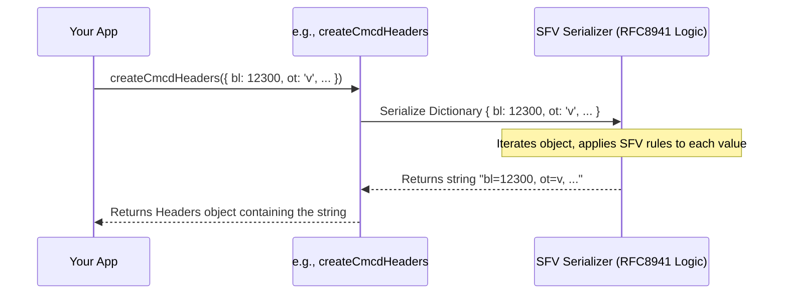
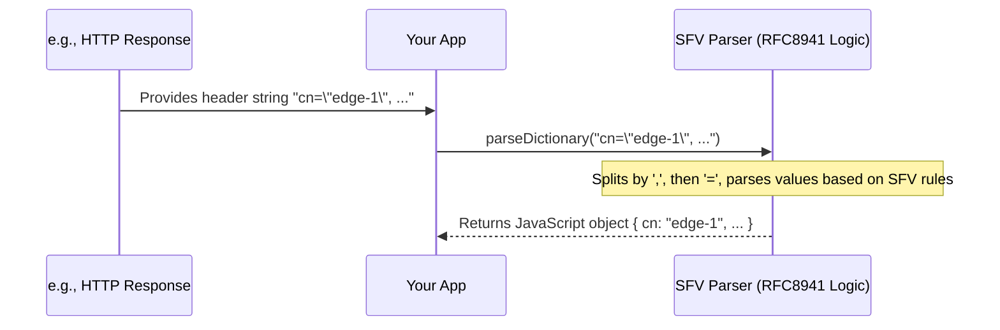

# Chapter 5: Structured Field Values (RFC8941) Serialization/Deserialization

In [Chapter 4: ISOBMFF (MP4) Box Parsing](04_isobmff__mp4__box_parsing_.md), we learned how to look inside media files to find specific information stored in "boxes". Now, let's zoom back out and revisit how metadata is communicated *alongside* media requests, specifically focusing on the language used within HTTP headers. Remember how we discussed CMCD and CMSD data being sent in headers back in [Chapter 2: CMCD Data Handling](02_cmcd_data_handling_.md) and [Chapter 3: CMSD Data Handling](03_cmsd_data_handling_.md)? This chapter explains the underlying "grammar" that makes that possible.

## What's the Big Idea? A Common Language for Header Data

Imagine you want to send a note with several pieces of information, like "Item: Apple, Quantity: 5, Urgent: Yes". If you just wrote "Apple 5 Yes", the receiver might get confused. Is "5" the quantity or part of the item name? Is "Yes" a separate item or related to the quantity? We need structure!

HTTP headers face a similar problem. They are just text strings, but often need to carry structured data like key-value pairs, lists, numbers, or true/false values. How do we write this data down in a way that both the sender and receiver understand exactly what's meant?

That's where **RFC8941: Structured Field Values (SFV)** comes in. It's a standard set of rules – like grammar and spelling for data – that defines how to represent structured information consistently within HTTP header text.

**Use Case:** Let's say your video player (using CMCD) needs to send the following information in an HTTP header:
*   Buffer length (`bl`): 12300 milliseconds
*   Object type (`ot`): video (`v`)
*   Is the buffer starved (`bs`)?: Yes (true)
*   Session ID (`sid`): "user-session-1a"

How can the `common-media-library` format this into a single text string for a header like `CMCD-Request`? And if a server sends back CMSD data like `CMSD-Response: cn="edge-1", etp=4000, live=?1`, how can the library reliably parse this string back into meaningful data (CDN node, throughput, live status)?

The answer lies in using the Structured Field Values standard, which this library implements.

## Key Concepts: The Rules of SFV (RFC8941)

SFV defines several basic data types and ways to combine them:

1.  **Basic Types:**
    *   **Integers:** Whole numbers (e.g., `42`, `-10`).
    *   **Decimals:** Numbers with fractional parts (e.g., `3.14`, `-0.5`). *Note: Decimals have limited precision.*
    *   **Strings:** Text enclosed in double quotes (e.g., `"hello world"`, `"session-1a"`). Backslashes (`\`) are used to escape special characters like quotes or backslashes within the string.
    *   **Tokens:** Short sequences of specific characters (letters, digits, `_`, `-`, `.`, `:`, `%`, `*`, `/`), *not* enclosed in quotes. Used for simple identifiers (e.g., `v`, `audio`, `GET`).
    *   **Booleans:** True (`?1`) or False (`?0`).
    *   **Byte Sequences:** Binary data encoded using Base64, enclosed in colons (e.g., `:SGVsbG8=:`).

2.  **Structured Types:**
    *   **Lists:** Ordered sequences of Items (basic types or inner lists), enclosed in parentheses `()` and separated by spaces (e.g., `(1 "apple" ?0)` represents a list containing the number 1, the string "apple", and false).
    *   **Dictionaries:** Key-value maps, where keys are Tokens and values are Items (basic types or inner lists). Represented as comma-separated `key=value` pairs (e.g., `a=1, b="hello", c=?1`). This is very common for CMCD/CMSD.

3.  **Parameters:** Dictionaries can also have *parameters* attached to their members. These are key-value pairs associated with a specific item, separated by semicolons `;` (e.g., `abc;a=1;b=2` is the Token `abc` with parameters `a=1` and `b=2`).

Think of SFV as the specific alphabet (`?`, `"`, `:`, numbers, letters) and grammar rules (commas for dictionaries, spaces for lists, `key=value`, parentheses) needed to write complex data into a simple text string that anyone following the RFC8941 standard can read correctly.

## How the Library Uses SFV

The `common-media-library` uses SFV rules internally for:

*   **Serialization:** Taking JavaScript objects (like your CMCD data) and converting them into correctly formatted SFV strings for use in HTTP headers or query parameters (though query parameters have slightly different encoding details sometimes handled separately).
*   **Deserialization:** Taking SFV strings received from HTTP headers (like a `CMSD-Response` header) and parsing them back into easy-to-use JavaScript objects.

### Example 1: Serialization (Object to SFV String)

Let's take our CMCD use case data and imagine using a library function (perhaps internally called by `createCmcdHeaders` from [Chapter 2: CMCD Data Handling](02_cmcd_data_handling_.md)) to serialize it into an SFV Dictionary string.

```typescript
import { serializeDictionary } from '@svta/common-media-library/sfv'; // Fictional direct access

const cmcdData = {
  bl: 12300,   // Number -> Integer
  ot: 'v',     // Short string -> Token
  bs: true,    // Boolean -> Boolean
  sid: "user-session-1a" // String -> String
};

try {
  // Note: CMCD has specific rules about which keys map to which SFV types.
  // This example assumes 'ot' is a Token, 'bs' a Boolean, 'bl' an Integer, 'sid' a String.
  const sfvString = serializeDictionary(cmcdData);

  console.log(sfvString);

} catch (error) {
  console.error("Serialization failed:", error);
}
```

**Expected Output:**

```
bl=12300, ot=v, bs=?1, sid="user-session-1a"
```
*(Note: The order of keys might vary)*

**Explanation:**

The `serializeDictionary` function (or similar logic inside CMCD/CMSD functions) takes the JavaScript object. It iterates through the keys:
*   `bl`: Recognizes `12300` as a number, formats it as an Integer `12300`.
*   `ot`: Recognizes `'v'` as a short string suitable for a Token, formats it as `v`.
*   `bs`: Recognizes `true` as a boolean, formats it as `?1`.
*   `sid`: Recognizes `"user-session-1a"` as a string, formats it as `"user-session-1a"` (with quotes).
It then joins these `key=value` pairs with commas to produce the final SFV Dictionary string, ready to be used as an HTTP header value.

### Example 2: Deserialization (SFV String to Object)

Now let's parse the CMSD header string from our use case. Imagine using a library function (perhaps internally called when processing responses) to deserialize it.

```typescript
import { parseDictionary } from '@svta/common-media-library/sfv'; // Fictional direct access

const cmsdHeaderValue = 'cn="edge-1", etp=4000, live=?1';

try {
  const cmsdData = parseDictionary(cmsdHeaderValue);

  console.log(cmsdData);

} catch (error) {
  console.error("Deserialization failed:", error);
}
```

**Expected Output:**

```javascript
{
  cn: 'edge-1', // String
  etp: 4000,    // Integer
  live: true    // Boolean
}
```

**Explanation:**

The `parseDictionary` function takes the header string. It performs the reverse operation:
*   Splits the string by commas: `"cn=\"edge-1\""`, `" etp=4000"`, `" live=?1"`.
*   For each part, splits by `=`: `cn` and `"edge-1"`, `etp` and `4000`, `live` and `?1`.
*   Parses the key (e.g., `cn`, `etp`, `live` - these are Tokens).
*   Parses the value according to SFV rules:
    *   `"edge-1"` starts and ends with `"`, so it's a String `edge-1`.
    *   `4000` looks like a number, so it's an Integer `4000`.
    *   `?1` matches the Boolean true pattern.
*   Builds and returns the corresponding JavaScript object.

## Under the Hood: How Serialization and Deserialization Work

Let's peek behind the curtain. The actual implementation involves careful parsing and state management according to the strict rules of RFC8941.

**Serialization Walkthrough (Simplified `serializeDictionary`):**

1.  **Input:** JavaScript object (`{ bl: 12300, ot: 'v', ... }`).
2.  **Iteration:** Loop through each key-value pair in the object.
3.  **Key Validation:** Check if the key is a valid SFV Token.
4.  **Value Serialization:** Determine the intended SFV type for the value based on its JavaScript type (and potentially specific CMCD/CMSD rules for that key).
    *   Number -> Format as Integer/Decimal string.
    *   Boolean -> Format as `?1` or `?0`.
    *   String -> Check if it can be a Token; if not, format as SFV String (add quotes, escape characters).
    *   Array -> Format as SFV List `(...)`.
    *   Object -> Format as SFV Dictionary `key=value,...` (potentially recursive).
5.  **Combine:** Create `key=serializedValue` strings for each pair.
6.  **Join:** Join the resulting strings with a comma and optional whitespace (`, `).
7.  **Output:** Return the final SFV Dictionary string.

**Serialization Sequence Diagram:**



**Deserialization Walkthrough (Simplified `parseDictionary`):**

1.  **Input:** SFV Dictionary string (`cn="edge-1", etp=4000, live=?1`).
2.  **Splitting:** Carefully split the string by commas (`,`), respecting quotes and parentheses to avoid splitting inside structured values.
3.  **Pair Processing:** For each resulting `key=value` string:
    a.  **Split Key/Value:** Find the first equals sign (`=`). The part before is the key, the part after is the value string.
    b.  **Parse Key:** Validate the key is a valid Token.
    c.  **Parse Value:** Use the first character(s) of the value string to determine its type (`"` for String, `?` for Boolean, `:` for Byte Sequence, `(` for Inner List, digit or `-` for Integer/Decimal, letter for Token) and parse accordingly, consuming characters.
    d.  **Parse Parameters (Optional):** If the value is followed by semicolons `;`, parse the subsequent key=value pairs as parameters attached to this item.
    e.  **Store:** Add the parsed key and parsed value (with parameters, if any) to a result object.
4.  **Output:** Return the resulting JavaScript object.

**Deserialization Sequence Diagram:**



**Simplified Code Insight:**

The core logic for SFV parsing and serialization likely resides in files under `lib/src/sfv/` or similar within the library project. Parsing, in particular, can be complex due to the need to handle various data types, potential errors, and edge cases precisely as defined by RFC8941.

Here's a conceptual glimpse of how boolean serialization/deserialization might work:

```typescript
// Simplified concept - NOT actual library code!

function serializeBoolean(value: boolean): string {
  return value ? '?1' : '?0';
}

function parseBoolean(stringValue: string): boolean | undefined {
  if (stringValue === '?1') {
    return true;
  }
  if (stringValue === '?0') {
    return false;
  }
  // It's not a valid SFV boolean
  // Real parser would handle errors/state differently
  return undefined;
}

// Example usage within a larger serializer/parser:
const myBool = true;
const sfvBoolString = serializeBoolean(myBool); // Result: "?1"

const receivedString = "?0";
const parsedValue = parseBoolean(receivedString); // Result: false
```
The actual library implementation handles the context (knowing *when* to expect a boolean) and integrates this logic into the larger parsing/serialization process for Lists, Dictionaries, etc.

## Conclusion

Structured Field Values (RFC8941) provide the essential, standardized "language" for embedding structured data like numbers, strings, booleans, lists, and dictionaries directly into HTTP header text. It's the foundation that allows CMCD and CMSD data to be reliably exchanged via headers.

In this chapter, we learned:
*   Why SFV is necessary for HTTP headers.
*   The basic data types (Integer, String, Token, Boolean, etc.) and structures (List, Dictionary) defined by SFV.
*   How the `common-media-library` uses SFV logic internally to **serialize** JavaScript objects into header strings (like for sending CMCD).
*   How it uses SFV logic to **deserialize** header strings back into JavaScript objects (like for parsing received CMSD).

Understanding SFV helps clarify how the CMCD and CMSD features discussed in earlier chapters actually format their data for transmission. You now have a solid grasp of the library's core functionalities: packaging, CMCD/CMSD handling, MP4 box inspection, and the SFV encoding standard.

With this knowledge of *what* the library does, let's take a final look at *how* the project itself is organized.

**Next:** [Chapter 6: Monorepo Structure & Tooling](06_monorepo_structure___tooling_.md)

---

Generated by [AI Codebase Knowledge Builder](https://github.com/The-Pocket/Tutorial-Codebase-Knowledge)