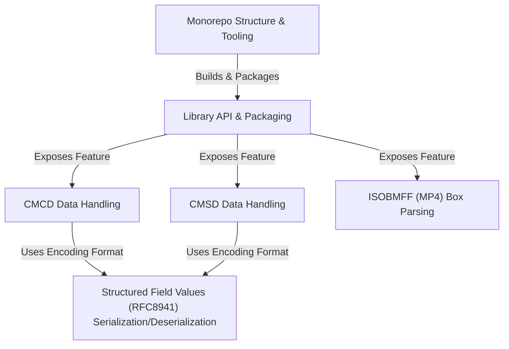

# Tutorial: common-media-library

This project provides a JavaScript library for handling common tasks in *streaming media*.
It helps developers create and understand **CMCD** (Common Media Client Data) and **CMSD** (Common Media Server Data), which are like status reports sent between media players and servers to optimize video delivery.
The library also includes tools for encoding/decoding data using **Structured Field Values** (a specific text format) and for inspecting the structure of **MP4** video files (*ISOBMFF boxes*).

**Source Repository:** [None](None)

## Chapters

1. [Library API & Packaging
](01_library_api___packaging_.md)
2. [CMCD Data Handling
](02_cmcd_data_handling_.md)
3. [CMSD Data Handling
](03_cmsd_data_handling_.md)
4. [ISOBMFF (MP4) Box Parsing
](04_isobmff__mp4__box_parsing_.md)
5. [Structured Field Values (RFC8941) Serialization/Deserialization
](05_structured_field_values__rfc8941__serialization_deserialization_.md)
6. [Monorepo Structure & Tooling
](06_monorepo_structure___tooling_.md)

---

Generated by [AI Codebase Knowledge Builder](https://github.com/The-Pocket/Tutorial-Codebase-Knowledge)