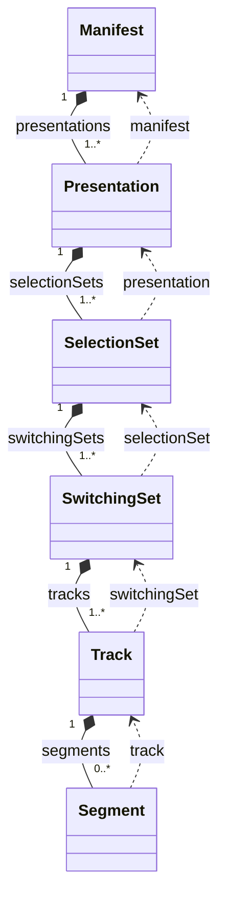
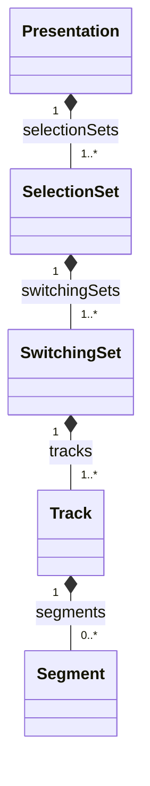

# Extending CMAF-HAM: Convergent Practice in avia-js and video.js

- **Status:** draft design note / RFC input for the SVTA Players & Playback working group
- **Authors:** maintainers from the avia-js (Paramount) and video.js teams
- **Scope:** the CMAF Hypothetical Application Model (HAM) as modeled in `@svta/cml-cmaf-ham` (`libs/cmaf-ham`)

## Purpose

Two independent production players have built on the CMAF Hypothetical Application Model (HAM) and, working separately, extended it in strikingly similar ways:

- **avia-js** (Paramount) consumes `@svta/cml-cmaf-ham@0.23.2` and hardens the `@alpha` types with a mixin.
- **video.js v10** ships a self-contained media model in its `spf` package (`packages/spf/src/media/types`), described in-source as "Based on CMAF-HAM."

This note is implementer-neutral. It maps where the two independently **converge** (candidates for the HAM library, since two teams reached the same design without coordinating) and where they **diverge** (open design questions, now with two production reference implementations to reason from). It is intended as input to the working group; each team also maintains its own detailed per-change writeup.

## The two models at a glance

Both keep the HAM hierarchy, `Presentation -> SelectionSet -> SwitchingSet -> Track -> Segment`, keyed by `Ham = { id }`.

| | avia-js CMAF plugin | video.js v10 SPF |
| --- | --- | --- |
| Relationship to CML | consumes `@svta/cml-cmaf-ham@0.23.2`, extends via `Override<>` | self-contained types "based on CMAF-HAM" |
| Format coverage | DASH + HLS | HLS-first (no DASH parser wired yet) |
| Composition mechanism | `Override<Base & Upstream, { ... }>` | intersections + generics (`Ham & AddressableObject & TimeSpan & { ... }`) |
| State model | mutable in-place graph | immutable updates over signals |
| Top of model | `Manifest` (multi-period, live/DVR) | `Presentation` (single-period; `startTime` always 0) |

The format-coverage difference is worth holding in mind: some divergences below are best read as "video.js has not needed it yet" (it is HLS-first and single-period) rather than genuine disagreement.

## Convergences: candidates for the HAM library

Each of these was invented independently by both teams. That is the strongest signal that the current `@alpha` model is missing it.

- **An addressable-object primitive.** Both define `{ url, byteRange?: { start, end } }` with numeric byte ranges, and both named it `AddressableObject` (dropping "Media" from CMAF's "Addressable Media Object").
- **`initialization` as an addressable object.** Both replaced `urlInitialization?: string` with an `initialization` field typed as the addressable object above, and both chose the name `initialization` (over CMAF's "Header").
- **Splitting `mimeType` from `codecs`.** The base model has a single `codec: string`. Both separated `mimeType` from codec information (avia `codecs: string` + `supplementalCodecs?`; video.js `codecs?: string[]`), because Media Source Extensions needs the full MIME type plus codecs to probe support.
- **Type discriminators on the set layers.** Both attach a track-type discriminator to the switching/selection layer and lean on discriminated unions for type-safe track access.
- **Compositional layering over a shared base.** Neither forked the model; both compose additive mixins onto the `Ham`-keyed hierarchy.

## Divergences: open design questions with two data points

For each, the two implementations made different, defensible choices. These mirror the open questions in avia-js's proposal, and are the decisions the working group is best placed to settle.

### A. Parent navigation and JSON-serializability
- **avia-js:** adds parent back-references at every layer (`segment.track`, `track.switchingSet`, ... up to `presentation.manifest`). Ergonomic traversal, but the pairs form reference cycles, so the graph is **not** JSON-serializable (avia ships a cycle-stripping serializer to work around it).
- **video.js:** no back-references; a pure downward tree that stays JSON-serializable. This is not incidental: SPF resolves content by **immutable updates over signals** (`update(state.presentation, ...)`), and an acyclic tree is what makes those updates tractable. Back-references would fight that architecture.
- **Signal:** video.js is a working proof that the acyclic, serializable model is sufficient for a full player. Strong evidence for keeping HAM serializable and treating navigation as a separate concern (IDs + lookup, or a computed view).

### B. Redundant vs. minimal timing
- **avia-js:** `startTime` + `endTime` + `duration` on periods and segments (any two determine the third).
- **video.js:** a single `TimeSpan = { startTime, duration }` mixin; `endTime` is derived, never stored.
- **Signal:** video.js already runs on the minimal canonical set in production.

### C. Signaling "not resolved yet"
Both lazily load parts of the model (media playlists / segment indexes) and need to distinguish "not loaded yet" from "loaded and genuinely empty."
- **avia-js:** a `null` value-sentinel (`segments: Segment[] | null`, `null` = not loaded) on a single mutable track shape.
- **video.js:** encodes resolution in the **type system**. A `PartiallyResolvedTrack` has no `segments` field at all (`segments?: never`); a fetch produces a `ResolvedTrack`; a type guard narrows by presence (`'segments' in track`). (Its only `| null` is a parse-intermediate meaning genuinely-absent.)
- **Signal:** same problem, two philosophies: **value-sentinel** vs **type-state**. Type-states give compile-time guarantees but multiply the type surface; a `null` sentinel is lighter but leans on runtime discipline.

### D. Layer extension mechanism
- **avia-js:** per-layer type override; adding a field to one layer forces overriding the whole stack.
- **video.js:** generics (`SwitchingSetOf<T>`, `SelectionSetOf<T>`, `PartiallyResolved<T>`), so the track type flows through the hierarchy from one parameter.
- **Signal:** video.js shows generics scale to the full set/selection hierarchy, one of the middle grounds between "bare base types" and "fork per implementer."

### E. Frame rate
- **avia-js:** simplified the `FrameRate { numerator, denominator? }` object to a single `number`.
- **video.js:** kept the `FrameRate` object.
- **Signal:** two implementers, opposite calls. The precise `num/denom` form carries information a single number loses (29.97 = 30000/1001).

### F. Image / trick-play tracks
- **avia-js:** added an `image` track type for thumbnails.
- **video.js:** video / audio / text only.
- **Signal:** no convergence yet; an avia-specific extension. Weaker evidence than the converged rows, but worth raising.

### G. Manifest, live, and multi-period
- **avia-js:** a `Manifest` root with live/DVR fields, a presentation-time offset, and true multi-period timing (server-side ad insertion).
- **video.js:** no `Manifest` type; `Presentation` is the top; single-period, no live fields.
- **Signal:** best read as coverage, not disagreement. avia is DASH + HLS with live and SSAI; video.js is HLS-first and single-period today. This is where the models will need to reconcile as each grows.

## Comparison matrix

| Concept | Base HAM (`@0.23.2`) | avia-js | video.js SPF | Verdict |
| --- | --- | --- | --- | --- |
| Byte range / init | `byteRange?: string`, `urlInitialization?: string` | `AddressableObject`, `initialization` | `AddressableObject`, `initialization?` | **converge** |
| Codec signaling | `codec: string` | `codecs: string` + `mimeType` + `supplementalCodecs?` | `codecs?: string[]` + `mimeType` | **converge** (differ on shape) |
| Set discriminators | none | `type` on selection set | `type` + discriminated unions | **converge** |
| Composition | (base) | per-layer override | intersections + generics | **converge** (mechanism differs) |
| Timing | `duration` | `startTime` + `endTime` + `duration` | `TimeSpan { startTime, duration }` | diverge (B) |
| Parent navigation | none | back-refs (cycles) | none | diverge (A) |
| JSON-serializable | yes | no | yes | video.js preserves invariant |
| Not-resolved-yet | (n/a) | `T \| null` | type-states + guards | diverge (C) |
| Layer extension | (n/a) | per-layer override | generics | diverge (D) |
| Frame rate | `FrameRate` object | `number` | `FrameRate` object | diverge (E) |
| Track types | audio/video/text | + image | audio/video/text | diverge (F) |
| Manifest / live | `Manifest` (input only) | `Manifest` + live + multi-period | none; single-period | diverge (G) |

## The graphs, side by side

The clearest way to see divergence A. Solid arrows are downward composition; dashed arrows are avia's parent back-references (the cycles).

**avia-js (navigable graph, cyclic):**

**video.js SPF (acyclic tree):**

## Recommendations for the working group

- **Adopt the converged items.** The addressable-object primitive, `initialization` as an object, the `mimeType` + `codecs` split, and set-layer discriminators were each reinvented independently. That is about as strong a signal as an `@alpha` model gets that they belong in the library.
- **Use the divergences to frame decisions, not to pick a winner.** Each open question (A parent navigation / JSON, B timing, C not-resolved-yet, D extension) now has two production implementations with articulated trade-offs. On A and B the two point in opposite directions, and video.js's choices preserve the acyclic / JSON-serializable invariant.
- **Keep the model a plain data model.** Both teams kept capability probing, buffering, and DOM concerns out of the shared types.
- **Mind format coverage.** video.js is HLS-first and single-period today; avia is DASH + HLS with live and SSAI. Some divergences (manifest / live / multi-period) are coverage gaps, not conflicts.

## References

- video.js v10 SPF media types: <https://github.com/videojs/v10/blob/main/packages/spf/src/media/types/index.ts>
- avia-js CMAF plugin (Paramount): detailed per-change proposal shared with the working group.
- **[CMAF]** ISO/IEC 23000-19:2020, *Common media application format (CMAF) for segmented media*.
- **[CTA-5005-A]** *Web Application Video Ecosystem: DASH-HLS Interoperability Specification*, June 2023.
