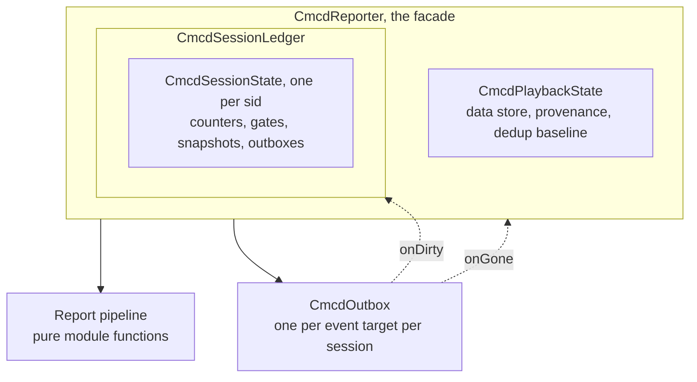
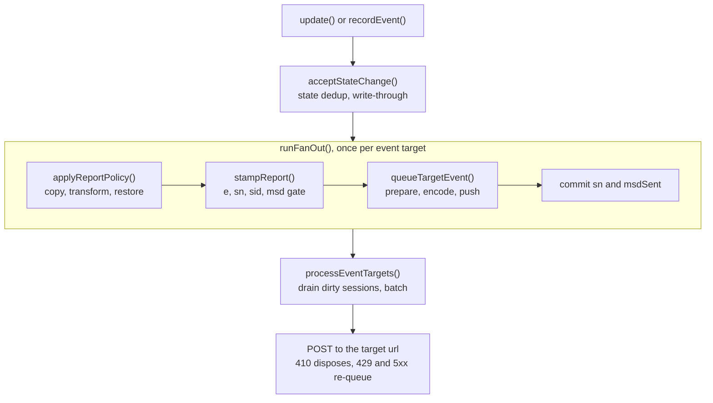
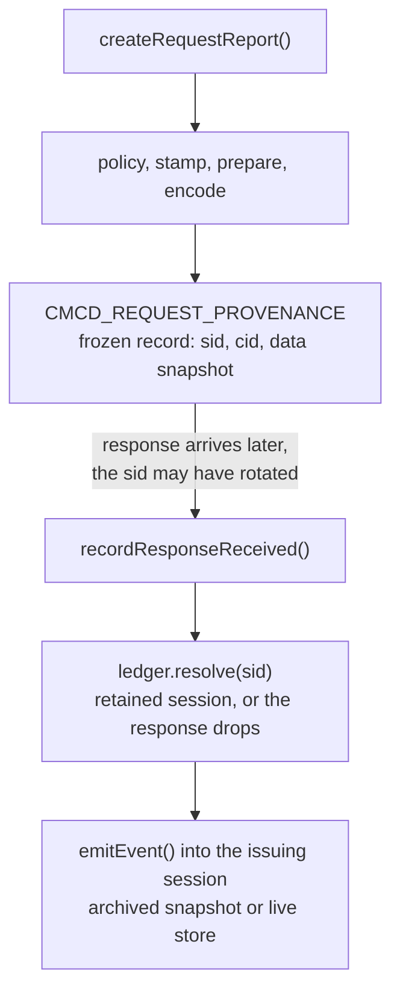

# CMCD Reporter Architecture Guide

This guide explains how `CmcdReporter` works inside. It is for contributors and for adopters who want to understand the reporter's behavior. It does not explain how to call the API. The [User Guide](./user-guide.md) covers that. The design record in [`plans/cmcd-reporter-architecture/`](https://github.com/streaming-video-technology-alliance/common-media-library/tree/main/plans/cmcd-reporter-architecture) holds the rationale, the alternatives, and the history.

None of the units below are public API. The public surface is the `CmcdReporter` class alone.

## Units and ownership

The reporter is a facade over four internal units. Each unit owns one kind of work.

The facade holds the public API, the normalized configuration, and the interval timers. It contains no report logic.

`CmcdPlaybackState` owns everything scoped to one playback: the persistent data store, the frozen base provenance record, and the state-change dedup baseline.

`CmcdSessionLedger` owns the retained sessions, keyed by `sid` and capped by `sessionRetention`. Each `CmcdSessionState` owns everything CTA-5004-B scopes to one session: sequence counters, the `msd` send gates, `bg`, frozen data snapshots, and one outbox per event target. The ledger also keeps the dirty set, the list of sessions whose outboxes hold unsent lines.

The report pipeline is a set of pure module functions. Each function receives state and returns a result. None of them keep state of their own.

`CmcdOutbox` owns delivery for one event target of one session: the queue of encoded lines, batching, the POST, and the retry rules. Two callbacks are bound at construction. `onDirty` marks the owning session in the ledger whenever the outbox holds unsent lines. `onGone` runs the session-scoped disposal when the collector answers HTTP 410.

## The event report pipeline

Every event source enters the same path: an `update()` auto-fire, a `recordEvent()` call, a derived response event, an interval tick, and the initial tick from `start()`.

The ordering enforces three contracts.

`applyReportPolicy()` gives a configured `transform` a detached copy of the report, so mutation cannot reach the persistent store or a sibling target's input. The function captures the required key's value before it makes that copy. A transform that drops or breaks a required key gets the pre-transform value restored. A `null` return cancels the report.

`stampReport()` writes the reporter-owned fields after the transform ran: `e`, `sn`, `sid`, and `msd` while the session's gate is open. A transform cannot forge any of them.

The commit runs last. `sn` increments, and `msdSent` is set, only after the report was prepared, encoded, and queued. A value that cannot serialize throws inside the recording call and consumes nothing. Both reporting modes consume the `msd` gate from the prepared output, so a target whose key filter removes `msd` does not consume it.

`runFanOut()` wraps every fan-out with the same tail: it tracks the fan-out depth, processes the queues, runs a held eviction, and rethrows the first error only after those steps ran. A throwing transform therefore never blocks the other targets or the queue drain.

Delivery is pull-based. `processEventTargets()` reads the ledger's dirty set, oldest session first, and asks each outbox to dispatch. An outbox sends when its queue reaches `batchSize`, or fully when the session ended or `flush()` ran. A 410 response disposes the target for the rest of its own session. A 429 or 5xx response re-queues the batch at the front, in the session that sent it.

## Request decoration and response attribution

Request mode runs the same pipeline contracts, and adds provenance so a late response reports correctly.

`createRequestReport()` stamps a frozen provenance record on every request it returns, including requests it does not decorate. The record carries the issuing `sid`, the `cid` in effect at issue time, and the per-call data encoded as a CMCD string.

Attribution reads the record's `sid` and nothing else. A record that names no retained session drops the response rather than relabeling it. A resolved session supplies its own counters, gates, and data. An archived session reports from the snapshot frozen when it ended. The current session reports from the live store.

## Session rotation and retention

A `sid` change rotates the ledger. The outgoing session archives a detached snapshot of the playback data, the new session becomes current, and the rotation epoch increments. The ledger then drains the ended session's outboxes, so a partial batch the session can never fill again leaves before eviction can destroy it. Eviction removes the oldest sessions beyond `sessionRetention`, and a rotation inside a fan-out defers that eviction until the outermost fan-out finished. A reused `sid` replaces its retained namesake and purges the replaced session from the dirty set.
