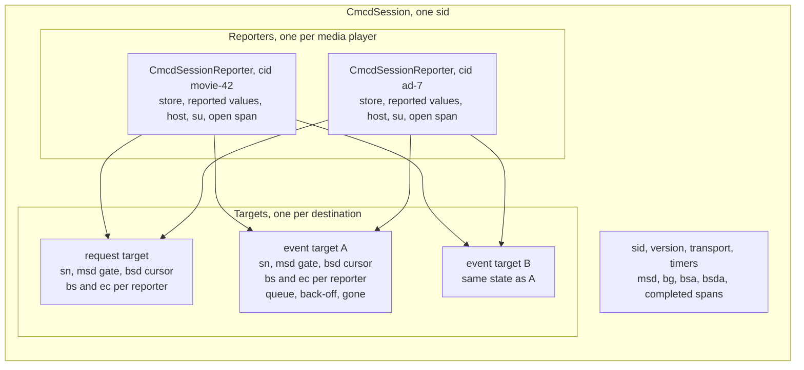
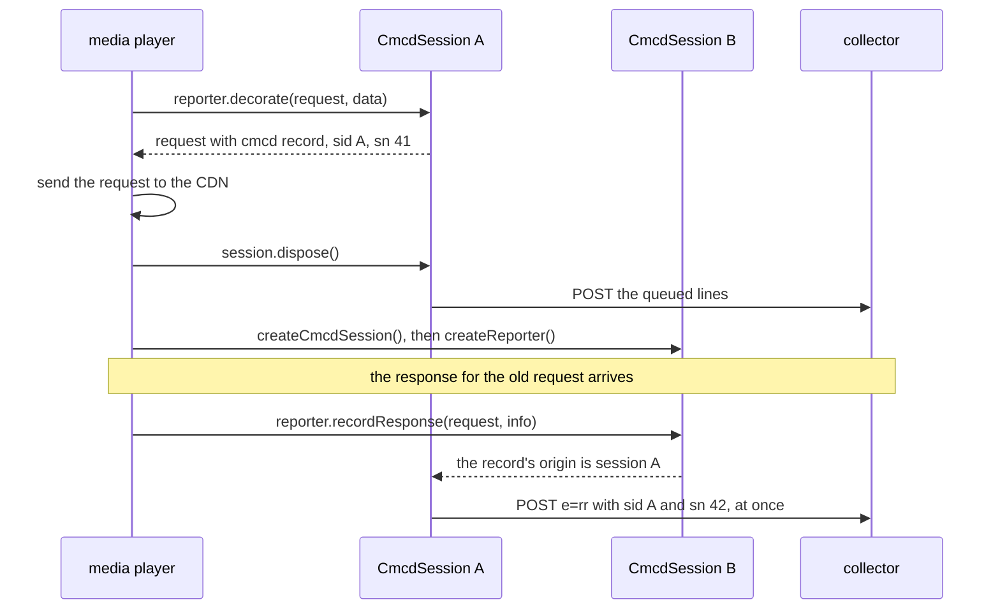
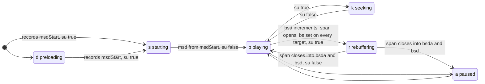
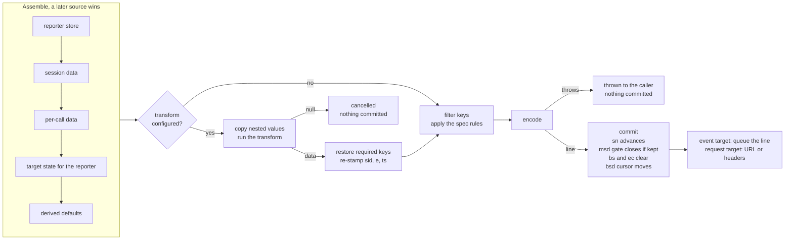
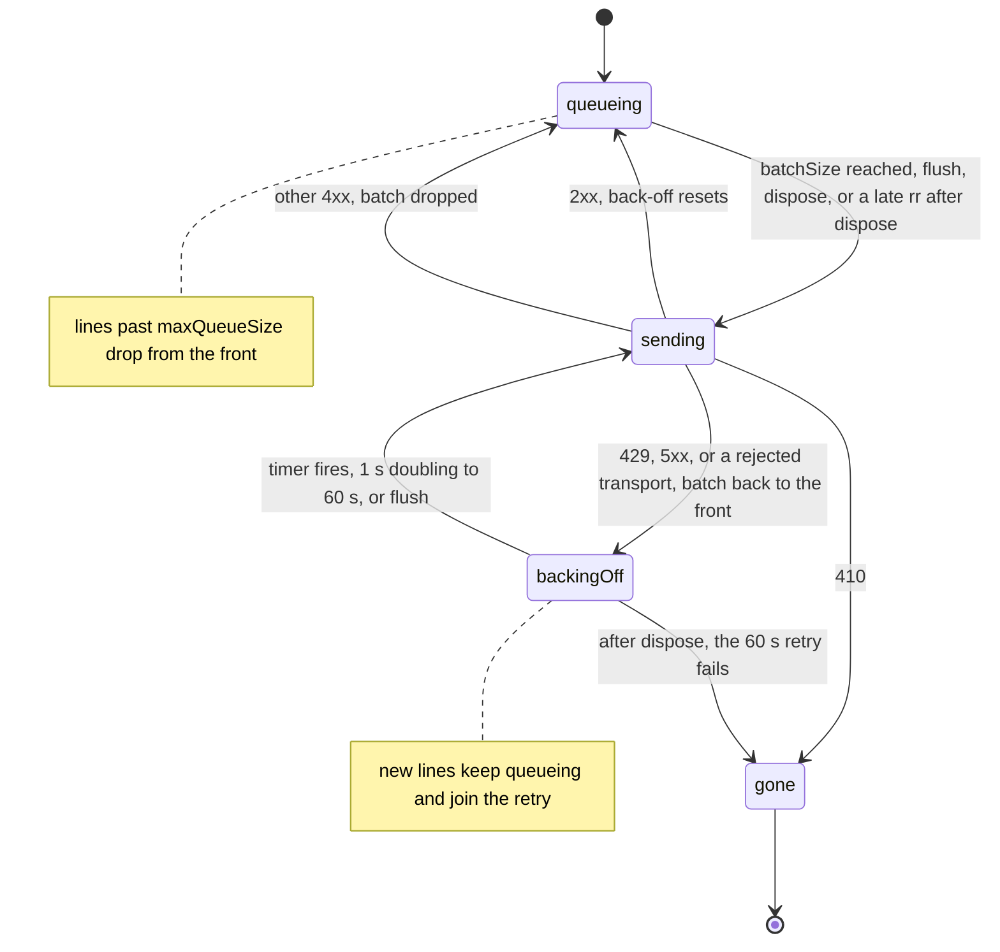

# RFC: Session API for CMCD version 2

| | |
|---|---|
| **Author** | Casey Occhialini |
| **Date** | 2026-09-09 |
| **Package** | `@svta/cml-cmcd` |
| **Breaking change** | No |

## Summary

Add a second reporting API to `@svta/cml-cmcd`, next to `CmcdReporter`. The new API has three objects that match the three scopes of CTA-5004-B.

- A `CmcdSession` is one `sid`. It owns the report targets, the transport, the interval timers, and the session totals.
- A `CmcdSessionReporter` reports for one media player inside the session. Through it the player pushes its state, records events, decorates its requests, and records their responses.
- A target is one report destination. Targets are internal. Each target owns the state the spec scopes to a destination. That state is the sequence number, the `msd` gate, the `bs` flag, the `ec` buffer, and the delivery queue.

The reporter derives every key the spec defines in terms of state the reporter can observe. A player never computes `msd`, `bs`, `su`, `sn`, the starvation counters, or the response timing keys. State-change events come only from `update()`. A session can hold several reporters, one per media player, and the wire shows one `sid` and one sequence per target.

```ts
import { createCmcdSession, CmcdEventType } from '@svta/cml-cmcd'

const session = createCmcdSession({
	keys: ['br', 'bl', 'd', 'ot', 'sid', 'cid', 'mtp', 'sf', 'st', 'su', 'nor'],
	eventTargets: [{ url: 'https://collector.example.com/cmcd' }],
})

const reporter = session.createReporter({ cid: 'movie-42' })

reporter.update({ sf: 'h', st: 'v' })
reporter.update({ sta: 'p', bl: 3200, mtp: 15000, pt: 12000 }) // emits e=ps with this snapshot

const req = reporter.decorate({ url: 'https://cdn.example.com/seg-1.m4s' }, { ot: 'v', d: 4000, br: 3000 })
const res = await fetch(req.url, { headers: req.headers })
reporter.recordResponse(req, { status: res.status, headers: res.headers }) // emits e=rr

reporter.recordError('MEDIA_ERR_NETWORK')
reporter.recordEvent(CmcdEventType.AD_BREAK_START)

session.dispose()
```

`CmcdReporter` does not change. It remains until players have migrated, and a later release marks it deprecated.

## Motivation

CMCD version 2 is much larger than version 1. It adds a second reporting mode, several targets with their own filters, 19 event types, and 32 new keys. It also adds rules that scope state to a session or to a destination. `CmcdReporter` encodes and sequences reports, but it leaves much of the spec to the player. The two largest adopters show the result. The table lists spec behavior that hls.js and dash.js implement by hand, read from their development branches on 2026-09-09.

| Spec behavior | hls.js | dash.js |
|---|---|---|
| `msd` from the `sta` starting to playing delta | not sent | `calculateMsd()` in `CmcdModel` |
| `bs` per destination since the last report | `starved` flag, cleared on the next video request | `wasPlaying()` and `onRebufferingStarted()` |
| `su` until the buffer is stable | `buffering` flag | set per request in `CmcdModel` |
| `dl` from buffer length and playback rate | computed per request | computed per request |
| `bsd` from rebuffering spans | not sent | `_rebufferingDuration` in `CmcdModel` |
| `ec` buffered per destination | fatal errors only, one event | `update({ ec })`, so the code stays on every later report |
| `cmsds` and `cmsdd` from response headers | not sent | base64 encoding in `CmcdController` |

The current API also has three traps that the two integrations fall into.

1. `update({ sta })` fires a `ps` event, and a following `recordEvent(PLAY_STATE, data)` is deduplicated. dash.js makes exactly that pair of calls. On `@svta/cml-cmcd` 2.4 or later its play-state events lose the `data` payload.
2. `recordResponseReceived()` attributes a response only through the provenance record on the decorated request. The hls.js loader passes `{ url }` from its loader context. The dash.js interceptor copies only the `cmcd` object from the decorated request. On 2.6 or later both players drop every `rr` event. Both pin older versions today.
3. Configuration is fixed at construction. Both players rebuild the reporter to apply a manifest setting, and the rebuild resets `sid` and every `sn`. dash.js has a comment about that reset.

Multi-player sessions are the case the current design fits worst. The spec expects one `sid` to span a movie and its interstitials, and the `bg` key is defined over "all players in a session". A second `CmcdReporter` with the same `sid` restarts every sequence number and sends `msd` again. The child-reporters proposal ([PR #398](https://github.com/streaming-video-technology-alliance/common-media-library/pull/398)) adds a root and child split to the current class. That proposal calls a session-first API "the right long-term shape" and set it aside for surface area.

Inside the package, `CmcdReporter` is one class with five jobs: session bookkeeping, report assembly, transform policy, delivery, and the public facade. Each feature since version 2.4 added pairwise interactions between those jobs. A refactor ([PR #422](https://github.com/streaming-video-technology-alliance/common-media-library/pull/422)) splits the class along those jobs while keeping every current semantic. This RFC asks a different question: which of those semantics would a design built for the version 2 spec keep at all? The answer removes session rotation, the retention window, eviction, the provenance record, and the `customData` generics. It adds derived keys and a reporter per media player. The design record in [`plans/cmcd-session-api/`](../plans/cmcd-session-api/) has the comparison.

## Guide-level explanation

### One session, one reporter per media player

Create one session per playback session. The session generates a `sid` when the configuration has none. A session never changes its `sid`. When the player needs a new `sid`, it disposes the session and creates a new one. Requests that are still in flight keep reporting under the session that issued them (see [Requests and responses](#requests-and-responses)).

```ts
const session = createCmcdSession({
	sid: 'session-abc-123',
	version: 1,             // wire version for request mode. Event mode is always version 2
	transmissionMode: 'headers',
	eventTargets: [
		{
			url: 'https://collector.example.com/cmcd',
			events: ['ps', 'e', 't', 'rr', 'bc'],
			keys: ['sid', 'cid', 'sta', 'br', 'bl', 'url', 'rc', 'ttfb', 'ttlb'],
			interval: 10,
			batchSize: 5,
			headers: { Authorization: 'Bearer token' },
		},
	],
})
```

Create one reporter per media player. The reporter for the primary player and the reporter for an interstitial player are the same type and use the same code.

```ts
const primary = session.createReporter({ cid: 'movie-42' })
const ad = session.createReporter({ cid: 'ad-7' })
```

Every reporter uses the session's `sid` and takes the next sequence number of each target. Dispose a reporter when its media player is destroyed.

The ownership in one picture. Targets belong to the session, and every reporter reports to every target.



### Push state, get events

`update()` stores playback state and derives the five state-change events from it: `sta` gives `ps`, `pr` gives `pr`, `cid` gives `c`, `bg` gives `b`, and `br` gives `bc`. The event fires when the value differs from the last value that reporter reported. Metrics pushed in the same call ride the event.

```ts
primary.update({ sta: 'r', bl: 0 })        // emits e=ps,sta=r,bl=(0)
primary.update({ sta: 'r', bl: 0 })        // emits nothing, no change
primary.update({ br: { v: 3000, a: 128 } }) // emits e=bc with br=(3000;v 128;a)
```

Interval reports and request reports read the same stored state, so push a metric when it changes. There is no second method for state-change events. The `recordEvent()` type accepts only the events that state cannot derive, so the compiler rejects `recordEvent(CmcdEventType.PLAY_STATE)`.

Values are plain. A key that the spec defines as an inner list with object-type parameters accepts a number, or one number per object type. `nor` accepts a string, an object with a `range`, or an array of them. The reporter builds the structured-field syntax.

### Discrete events and errors

`recordEvent()` covers the ad events, `sk`, `m`, `um`, `pe`, `pc`, and `ce`. A custom event requires `cen`. The `data` argument applies to that one report.

```ts
ad.recordEvent(CmcdEventType.AD_START)
ad.recordEvent(CmcdEventType.CUSTOM_EVENT, { cen: 'ad-quartile', 'com.example-quartile': 'q3' })
```

`recordError()` follows the spec's error rule. A target that lists `e` in its events receives an `e=e` report at once, with `ec`. Every other target, the request target included, buffers the code and attaches `ec` to the reporter's next report to that destination.

```ts
primary.recordError('MEDIA_ERR_NETWORK')
primary.recordError(['DRM_NOT_SUPPORTED', 'PLAYBACK_FAILED'])
```

### Requests and responses

`decorate()` returns a copy of the request with the CMCD query parameter or the CMCD headers applied, plus a `cmcd` record. The second argument is the data for this one request. An existing `CMCD` query parameter in the URL is replaced. A `nor` given as an absolute URL becomes a path relative to the request URL.

```ts
const req = primary.decorate(
	{ url: frag.url, headers: {} },
	{ ot: 'v', d: 4000, br: 3000, nor: next.url },
)
// req.url has the CMCD query parameter, or req.headers has the four CMCD headers
// req.cmcd.data is the report as sent, for logging or a player event
```

Hand the returned request back with the response. The reporter derives `url`, `rc`, `ts`, `ttfb`, and `ttlb`, and reads `cmsds` and `cmsdd` from the `CMSD-Static` and `CMSD-Dynamic` response headers.

```ts
primary.recordResponse(req, {
	status: res.status,
	headers: res.headers,
	timing: performance.getEntriesByName(req.url)[0],
})
```

`timing` is optional. Without it, the reporter computes `ts` and `ttlb` from the clock reading it recorded in `decorate()`. A request the player did not keep can still be recorded with `{ url }`. That response reports under the calling reporter's session.

A response can arrive after the player has disposed the session that issued the request. The record on the request points to that session, so the `rr` report has the old `sid` and the old session's next sequence number. The old session sends the report at once, because no batch will fill again.

The sequence for a response that arrives after its session was disposed:



### Interstitials

The spec covers multi-player sessions with `cid`, `ps`, and `nr`. The session API needs no other concept. When an interstitial renders on its own player, the primary player sets `nr` while it fetches content that the user does not see.

```ts
const ad = session.createReporter({ cid: hash(asset.uri) })
primary.update({ nr: true })
ad.update({ sta: 'p' })
// ...
ad.dispose()
primary.update({ nr: false })
```

Each interval tick emits one `t` line per live reporter, with the same `ts` and consecutive sequence numbers. Overlay and side-by-side interstitials report both players, and a collector tells them apart by `cid` and `nr`.

The wire during a sequential interstitial. Keys other than the ones shown are omitted.

```text
# The primary pauses and stops rendering while the ad player starts
cid="movie-42",e=ps,nr,sid="s1",sn=7,sta=a,ts=1764752400000,v=2
cid="ad-7",e=as,sid="s1",sn=8,ts=1764752400050,v=2
cid="ad-7",e=ps,sid="s1",sn=9,sta=p,ts=1764752400120,v=2

# One interval tick: one t line per live reporter, same ts, consecutive sn
cid="movie-42",e=t,nr,sid="s1",sn=10,sta=a,ts=1764752430000,v=2
cid="ad-7",e=t,sid="s1",sn=11,sta=p,ts=1764752430000,v=2

# The ad ends and its reporter is disposed, the primary renders again
cid="ad-7",e=ae,sid="s1",sn=12,ts=1764752445000,v=2
cid="movie-42",e=ps,sid="s1",sn=13,sta=p,ts=1764752445200,v=2
```

### Lifecycle

Creating a session arms its interval timers. `flush()` sends every queued batch now. `dispose()` flushes, stops the timers, and closes the session. Calls on a disposed reporter or session do nothing.

```ts
window.addEventListener('pagehide', () => session.flush())
// on player destroy
session.dispose()
```

## Reference-level explanation

### New exports

| Export | Kind |
|---|---|
| `createCmcdSession` | function |
| `CmcdSession`, `CmcdSessionConfig` | types |
| `CmcdSessionReporter`, `CmcdSessionReporterConfig`, `CmcdPlaybackData`, `CmcdMetric`, `CmcdNextObject` | types |
| `CmcdEventTargetConfig`, `CmcdTransport` | types |
| `CmcdRequestLike`, `CmcdDecoratedRequest`, `CmcdRequestRecord`, `CmcdResponseInfo`, `CmcdResourceTiming` | types |
| `CmcdRequestTransform`, `CmcdEventTransform` | types |
| `CmcdDiscreteEventType` | type |
| `CMCD_EVENT_HOSTNAME`, `CmcdEventType.HOSTNAME` | constant, the missing `h` event |

### Configuration

```ts
type CmcdSessionConfig = {
	sid?: string                                // default: a new UUID
	version?: CmcdVersion                       // request mode only. default CMCD_V2
	transmissionMode?: CmcdTransmissionMode     // default CMCD_QUERY
	keys?: readonly CmcdKey[]                   // request mode allowlist. default: every key of the version
	headerMap?: Partial<CmcdHeaderMap>          // header shard per custom key
	transform?: CmcdRequestTransform
	eventTargets?: readonly CmcdEventTargetConfig[]
	transport?: CmcdTransport                   // default: fetch, POST, keepalive
	derive?: Partial<Record<'bg' | 'dl' | 'su', boolean>>  // observations the reporter may turn into defaults. default: all true
	onError?: (error: unknown) => void
}

type CmcdEventTargetConfig = {
	url: string
	events?: readonly CmcdEventType[]           // default ['ps', 'e', 't', 'rr']
	keys?: readonly CmcdKey[]                   // default: every event key
	interval?: number                           // seconds. default 30. 0 disables t
	batchSize?: number                          // default 1
	maxQueueSize?: number                       // lines. default 500
	headers?: Readonly<Record<string, string>>  // sent with every POST
	transform?: CmcdEventTransform
}

type CmcdSessionReporterConfig = {
	cid?: string
}
```

```ts
type CmcdTransport = (request: HttpRequest) => Promise<{ status: number }>
```

`transport` sends the event-mode POST requests. It receives an `HttpRequest` with `url`, `method`, `headers`, and `body`, and it resolves with the response status. The default is `fetch` with `keepalive`. It is the `requester` argument of `CmcdReporter` under a new name, so the loader adapters that hls.js and dash.js inject today move over unchanged.

`derive` names the three observations the reporter may turn into a default value when the player has not supplied the key: `bg` from document visibility, `dl` from `bl` and `pr`, and `su` from the play state. Each is on by default, and `false` turns it off. The other derived keys are spec definitions and have no switch. A supplied value wins for all of them.

The defaults make `{ url }` a complete event target and `createCmcdSession()` a complete request-mode configuration. The spec's minimum recommended event set is `ps`, `e`, `t`, and `rr`. A configuration error throws at `createCmcdSession()` or `createReporter()`. The message names the parameter, the expected value, and the received value. The checks:

- a `sid` over 64 characters
- a `cid` over 128 characters
- an unknown key or a malformed custom key in a `keys` list
- an unknown event type
- a target without `url`
- a negative `interval`
- a `batchSize` under 1
- an event target with `version`

### Objects

```ts
type CmcdSession = {
	readonly sid: string
	createReporter(config?: CmcdSessionReporterConfig): CmcdSessionReporter
	flush(): void
	dispose(): void
}

type CmcdSessionReporter = {
	readonly session: CmcdSession
	update(data: CmcdPlaybackData): void
	recordEvent(type: Exclude<CmcdDiscreteEventType, 'ce'>, data?: CmcdPlaybackData): void
	recordEvent(type: 'ce', data: CmcdPlaybackData & { cen: string }): void
	recordError(code: string | readonly string[], data?: CmcdPlaybackData): void
	decorate<R extends CmcdRequestLike>(request: R, data?: CmcdPlaybackData): CmcdDecoratedRequest<R>
	recordResponse(request: CmcdRequestLike, response: CmcdResponseInfo, data?: CmcdPlaybackData): void
	dispose(): void
}

type CmcdDiscreteEventType = 'as' | 'ae' | 'abs' | 'abe' | 'sk' | 'm' | 'um' | 'pe' | 'pc' | 'ce'
```

`CmcdDiscreteEventType` is `CmcdEventType` without the derived types `ps`, `pr`, `c`, `b`, `bc`, `t`, `rr`, `e`, and `h`.

### Data

`CmcdPlaybackData` is the one input type for `update()`, per-event data, per-request data, and per-response data. Every member is optional.

| Members | Type |
|---|---|
| `sta`, `sf`, `st`, `ot` | the existing token unions |
| `cid`, `cs`, `h` | `string` |
| `bg`, `bs`, `nr`, `su` | `boolean` |
| `d`, `dfa`, `dl`, `ltc`, `msd`, `pr`, `pt`, `rtp` | `number` |
| `ab`, `bl`, `br`, `bsa`, `bsd`, `bsda`, `lab`, `lb`, `mtp`, `pb`, `tab`, `tb`, `tbl`, `tpb` | `CmcdMetric` |
| `nor` | `CmcdNextObject \| readonly CmcdNextObject[]` |
| `ts` | `number`, the time of the transition, not stored |
| custom keys | `CmcdCustomValue` |

```ts
type CmcdMetric = number | Readonly<Partial<Record<CmcdObjectType, number>>>
type CmcdNextObject = string | { readonly url: string; readonly range?: string }
```

`ec` is not a member. Errors go through `recordError()`. `sid`, `sn`, `v`, `e`, and the response keys are reporter-owned and not members. The reporter rounds values per the spec: integer keys to the nearest integer, and `bl`, `dl`, `mtp`, `rtp`, and `tbl` to the nearest 100. Pass raw values.

`update()` merges `data` into the reporter's store. A member set to `undefined` removes the key. `bg`, `msd`, `bsa`, `bsda`, and `bsd` are session facts. Pushing one of them through any reporter writes it on the session, and automatic tracking of that key stops for the rest of the session.

### State-change events

After the merge, the reporter compares the five tracked fields with the values it last reported for that reporter. The order is `sta`, `pr`, `cid`, `bg`, `br`. Each changed field emits its event to every target that lists it, with the merged store as the report. Two spec clauses shape the rule.

- `pr` fires only while `sta` is `p`. A rate change while paused fires once on resume, if the rate still differs from the last reported rate.
- `bg` is compared on the session, and `b` follows the one-line-per-reporter rule of interval reports.

The `cid` given to `createReporter()` counts as reported, so creating a reporter emits no `c`. The first `sta` and the first `br` emit, because nothing was reported before. `b` on exit is sent as `bg=?0`, as today.

### Derived keys

A derived key is a key the reporter computes from state it observes. A derived default is a derived key the reporter fills only when the player has not supplied it. A value from `update()` wins for the rest of the session, and a value in per-call data wins for that report. The last column says how a supplied value interacts with each key.

| Key | Derived from | Scope | Supplied value |
|---|---|---|---|
| `sn`, `ts`, `v`, `e` | counters and clocks | target and report | ignored |
| `msd` | the first `sta` s to the next `sta` p | session, sent once per target | wins, stops tracking |
| `bs` | `sta` entering r | target and reporter, cleared by the next report | wins for that report |
| `bsa`, `bsda`, `bsd` | spans between `sta` transitions | session totals, `bsd` cursor per target | wins, stops tracking |
| `su` | in s, k, or r, or no p since one | reporter | wins |
| `dl` | `bl` divided by `pr`, nearest 100 ms, only when `pr` is over 0 | reporter | wins |
| `h`, event `h` | the host of decorated request URLs | reporter | wins, stops tracking |
| `bg`, event `b` | `document.visibilityState`, when `derive.bg` is on | session | wins, stops tracking |
| `url`, `rc`, `ts`, `ttfb`, `ttlb` | request URL, status, timing | response | wins |
| `cmsds`, `cmsdd` | `CMSD-Static` and `CMSD-Dynamic` response headers | response | wins |

`bsa` counts the transitions into `r`. `bsda` and `bsd` count completed spans only. A span still open at `dispose()` is dropped. Automatic `bsa`, `bsd`, and `bsda` entries have no cause token. `url` is the request URL without its `CMCD` parameter. `rc` is `0` when `status` is absent. `ts` for a response is the request start.

The `sta` transitions and what each one derives. Transitions with no effect on a derived key are left out.



### Reports and targets

Every report is assembled in a fixed order, and a later source wins:

1. the reporter's store
2. the session data
3. the per-call data
4. the target's per-reporter state
5. the derived defaults

The target's `transform` runs on a copy when one is configured, and `null` cancels the report for that target. The reporter then filters the keys, applies the spec rules, encodes, and only then commits: `sn` advances, the `msd` gate closes when the output kept `msd`, `bs` and the `ec` buffer clear, and the `bsd` cursor moves. A cancelled or failed report commits nothing.

The report path for one target:



Filtering follows the target's `keys`. A key the current event requires is included whatever the list says:

- `e` and `ts` on every event report, and `v` in version 2
- `sta` on `ps`, `pr` on `pr`, `cid` on `c`, `bg` on `b`, and `br` on `bc`
- `ec` on `e`, `cen` on `ce`, and `url` on `rr`

The response keys appear only on `rr`. `cen` appears only on `ce`. `d` and `tpb` follow the object-type rule, and `ab`, `lab`, and `tab` yield to `br`, `lb`, and `tb`, as the encoder does today.

Each interval tick emits one `t` line per live reporter, in creation order, or one session-only line when the session has no reporter. Session-triggered events, `t` and `b`, follow that rule. Reporter-triggered events emit one line for that reporter. The first `t` report of a target comes one interval after creation. Today's `start()` sends one at once. The `ps` event for `sta` s already marks the start of a session.

### Requests

`decorate()` returns a new object. `url` has the `CMCD` query parameter in query mode. `headers` has the four `CMCD-` headers in header mode, and an empty shard is omitted. `cmcd` is the request record.

```ts
type CmcdRequestLike = {
	readonly url: string
	readonly headers?: Readonly<Record<string, string>>
}

type CmcdDecoratedRequest<R extends CmcdRequestLike> = R & {
	readonly cmcd: CmcdRequestRecord
}

type CmcdRequestRecord = {
	readonly sid: string
	readonly data: Readonly<Cmcd>   // the report as sent, after keys and transform
}
```

The record is a plain object. Spread and `Object.assign` keep it. JSON does not keep the link to the origin. A response for a request that crossed a JSON boundary reports under the calling reporter's session. A request that the transform cancelled still receives a record, so its response is attributed.

There is no registry of sessions. The record is the key in a reporter-internal `WeakMap`. The value is the origin: the session and the reporter that issued the request, the per-request data, and the start time. `recordResponse()` on any reporter looks the record up and reports through that origin. The entry lives as long as the request object, and the origin keeps its session reachable, so nothing else tracks past sessions.

### Responses

```ts
type CmcdResponseInfo = {
	status?: number                              // rc. 0 when absent
	headers?: Headers | Readonly<Record<string, string>>
	timing?: CmcdResourceTiming
}

type CmcdResourceTiming = {
	startTime: number                            // DOMHighResTimeStamp
	responseStart?: number
	responseEnd?: number
	duration?: number
}
```

A `PerformanceResourceTiming` entry satisfies `CmcdResourceTiming`. The `rr` report is assembled in this order, and a later source wins:

1. the origin reporter's store
2. the session data
3. the per-request data given to `decorate()`
4. the derived response keys
5. the `data` argument

It goes to every event target of the origin session that lists `rr`.

### Transforms

```ts
type CmcdRequestTransform = (data: Cmcd, request: Readonly<CmcdRequestLike>) => Cmcd | null
type CmcdEventTransform = (data: Cmcd, request: Readonly<CmcdRequestLike> | undefined) => Cmcd | null
```

The contract is the one the transforms RFC defined. The reporter copies nested values before a configured transform runs, re-stamps the reporter-owned keys after it returns, and restores a required key the transform removed. A transform that throws cancels that target's report. The error is thrown to the caller after every other target has been processed. The `request` argument is the request the player passed to `decorate()`. Read player fields through a cast or bracket access.

### Delivery

Each event target queues encoded lines. It sends a batch when the queue reaches `batchSize`, on `flush()`, on `dispose()`, or at once for a late `rr` report after dispose. A batch is one POST with content type `application/cmcd`, the lines joined by a line feed, no trailing line feed, and the target's `headers`. The default transport is `fetch` with `keepalive` set when the body is under 64 KB, so a `flush()` on `pagehide` completes.

| Response | Action |
|---|---|
| 2xx | done, back-off resets |
| 410 | the target sends nothing else for this session |
| 429, 5xx, or a rejected transport | the batch returns to the front of the queue, and the target retries after a back-off |
| other 4xx | the batch is dropped, back-off resets |

The back-off starts at one second and doubles to a cap of 60 seconds. New lines keep queueing during the back-off and go out with the retry, which is the aggregation the spec recommends for 429. After `dispose()`, a target stops retrying when a retry at the 60 second step fails. When a queue exceeds `maxQueueSize`, the oldest lines are dropped.

The delivery states of one event target:



### Errors

Runtime data never throws. An unknown or empty value is omitted, as the spec requires. A value the structured-field encoder cannot serialize throws at the call that produced it, and nothing is committed. `createReporter()` on a disposed session throws. Every other call on a disposed reporter or session is a no-op.

`onError` receives the errors that have no caller. Those are a transform or encoding failure on an interval tick, and a transport that still fails after the back-off cap. Without `onError`, those errors are thrown from the timer callback, as today.

### Bundle and performance

The estimates below are for the design record to verify with a prototype.

| Measure | `CmcdReporter` today | This API, estimate |
|---|---|---|
| Minified, request mode only | 18.8 KB | at or below 18.8 KB |
| Minified with gzip | 7.1 KB | at or below 7.1 KB |
| Objects per report | 1, plus copies when a transform runs | 1, plus copies when a transform runs |

The retention ledger, the eviction pass, the dirty set, and the provenance encoding go away. The derivation code and the key table arrive. A player that imports only `createCmcdSession` does not bundle `CmcdReporter`. Event-mode delivery is bundled whenever the session API is, because the configuration is data.

### Migration from `CmcdReporter`

| `CmcdReporter` | Session API |
|---|---|
| `new CmcdReporter(config, requester)` | `createCmcdSession({ ...config, transport })` and `session.createReporter({ cid })` |
| `enabledKeys` | `keys` |
| `customHeaderMap` | `headerMap` |
| `sessionRetention`, `CMCD_REQUEST_PROVENANCE`, the `C` type parameter | removed |
| `update(data)` | `reporter.update(data)` with plain values |
| `update({ sid })` | dispose the session and create a new one |
| `recordEvent(PLAY_STATE, data)` and the other state events | `reporter.update(data)` |
| `recordEvent(ERROR, { ec })` | `reporter.recordError(codes)` |
| `createRequestReport(request, data)` | `reporter.decorate(request, data)` |
| `recordResponseReceived(response, data)` | `reporter.recordResponse(req, info, data)` |
| `start()` | creation |
| `stop(true)` | `session.dispose()` |
| `flush()` | `session.flush()` |
| `createChildReporter()` (proposed) | `session.createReporter()` |

A sketch of the hls.js change in `CMCDController`:

- create the session and one reporter on `MANIFEST_LOADING`
- delete the `starved` and `buffering` flags and the `dl` arithmetic
- keep the decorated request on the loader wrapper, so `onSuccess` can pass it to `recordResponse()`
- create one reporter per interstitial asset, and set `nr` on the primary at asset start and clear it at primary resume

The dash.js change deletes `calculateMsd()`, the rebuffer tracking, the `ec` persistence, and the rebuild logic. It passes the decorated request through its interceptors.

## Drawbacks

- **Two reporting APIs in one package.** Until `CmcdReporter` is removed, both need documentation and tests. Adopters must choose.
- **Two objects in the simplest integration.** A request-only player still creates a session and a reporter.
- **One `t` line per reporter changes the wire during interstitials.** A collector that expected one interval line per `sid` sees two while an interstitial reporter exists.
- **A DOM side effect.** The session listens to `visibilitychange` when a document exists. `derive: { bg: false }` turns that off.
- **Derived defaults are assumptions.** `dl` from `bl` and `pr`, and `su` from the play state, match what hls.js and dash.js compute today. The spec words `dl` as a possible equivalence only.
- **Exact attribution needs the returned request.** A player that keeps only the URL gets current-session attribution for late responses.
- **In-flight requests keep their session reachable.** There is no retention knob. Memory is bounded by the requests the player keeps.
- **Event-mode code is always bundled** with the session API, because targets are configuration objects. `CmcdReporter` has the same property today. The factory-function alternative in Rationale would improve on both.
- **Wire differences from `CmcdReporter`.** The first `t` report comes after one interval. `ec` no longer persists across reports. `bs` is per destination.

## Rationale and alternatives

- **Refactor in place ([PR #422](https://github.com/streaming-video-technology-alliance/common-media-library/pull/422)).** Keeps the public API and every 2.6 semantic. It organizes session rotation, retention, eviction, dirty tracking, and provenance into units, and it keeps them. This RFC removes them. The design record compares the two.
- **One object that is both the session and the primary reporter.** One fewer line in the common case. It recreates the root and child asymmetry of the child-reporters proposal, where a child cannot do what the root does.
- **An explicit `activate()` for interval reports.** The child-reporters proposal's answer. It needs two calls in the interstitials controller and gives wrong data when a teardown skips the return call. One line per live reporter needs no call and loses no reporter.
- **A presenting-reporter rule for one interval line.** The first draft of this design used the most recently updated reporter without `nr`. Overlay and side-by-side interstitials render both players, so the rule flips on every metric push.
- **The provenance record and the retention ledger (2.6.0).** Exact attribution for every request, including undecorated ones, and it survives JSON with a bridge. Its cost is the ledger, the eviction pass, a symbol on `customData`, and a contract that neither adopter meets today.
- **Attribution from the wire.** Parse the `sid` back out of the `CMCD` query parameter or the `CMCD-Session` header. It works with a URL alone and survives every boundary. It costs a decode per response, it fails in header mode without the headers, and it cannot attribute a cancelled or undecorated request. It remains possible as a later fallback.
- **A pull model.** A `getState()` callback read at report time gives fresh interval data. A pull cannot see a `sta` transition when it happens, so transitions still need a push, and the player has two data paths.
- **Targets as factory functions.** `requestTarget()` and `eventTarget()` would let a request-only player tree-shake event mode. It adds a concept and an import for every integration. The configuration shape here matches `CmcdReporterConfig`, which both adopters already map.
- **`formatters` on the session API.** Custom formatters remain on `encodeCmcd`. The transform is the per-report hook of this API, and the built-in rounding is a spec `MUST` for `dl`, `mtp`, and `rtp`.
- **`ts` as a second `update()` argument.** It would keep the payload type to stored keys. Kept in the payload for now, because every other reporting call takes `ts` in its payload too.
- **`start()` and `stop()`.** Both adopters call them only as a constructor and destructor pair. Creation and `dispose()` cover that with two calls.

## Prior art

- **hls.js** `CMCDController` and **dash.js** `CmcdController` drive `CmcdReporter` today, and both compute the spec behavior listed in Motivation by hand.
- **Shaka Player** `CmcdManager` is an independent implementation with the same fields per media player and no session sharing.
- **The report transforms RFC** ([`rfc/cmcd-reporter-middleware.md`](./cmcd-reporter-middleware.md)) defined the transform contract this API reuses.
- **The session retention RFC** ([`rfc/cmcd-session-retention.md`](./cmcd-session-retention.md)) defined the late-response goal this API meets by object lifetime.
- **The child-reporters RFC** ([PR #398](https://github.com/streaming-video-technology-alliance/common-media-library/pull/398)) defined the state partition between a session and a player that this API makes the primary model.
- **The starvation counters design** ([`plans/cmcd-session-counters/design.md`](../plans/cmcd-session-counters/design.md)) settled the supplied-value precedence this API uses for every derived key.

## Unresolved questions

1. **Configuration shape.** Top-level request settings plus `eventTargets`, as proposed, or a `targets` list of factory functions that tree-shakes event mode.
2. **`bg` from document visibility by default.** On by default with an opt-out, or off by default. **Resolution (2026-09-09):** on by default. `derive: { bg: false }` turns it off.
3. **`dl` as a derived default.** Keep it, or make `dl` player-supplied only. **Resolution (2026-09-09):** kept as a derived default. A supplied `dl` wins, and `derive: { dl: false }` turns the default off.
4. **One `t` line per live reporter.** Collector feedback on two lines per interval during interstitials.
5. **`b` on exit.** `bg=?0`, as today, or a bare `e=b` as the token description implies.
6. **`ts` in the `update()` payload**, or a second argument.
7. **A URL-only `recordResponse()`** with attribution parsed from the wire, or the current-session fallback alone.
8. **`onError` signature.** A single callback, or a context argument that names the target and the stage.
9. **Names.** `CmcdSessionReporter` and `CmcdPlaybackData` next to the existing `CmcdPlayerState` token union.

## Future possibilities

- `encodeCmcd` accepts the plain values of `CmcdPlaybackData`, once the shared preparation step normalizes them.
- Automatic response recording through a `PerformanceObserver`, so a browser player never calls `recordResponse()`.
- `Retry-After` from a 429 response, when the transport returns headers.
- A per-target URL filter for the `url` key, per spec item 19. A transform covers it today.
- `CmcdReporter` marked deprecated after hls.js and dash.js migrate, and removed in the next major version.

## Final Decision

*(Completed after review)*

**Decision:**
**Rationale:**
**Date:**
